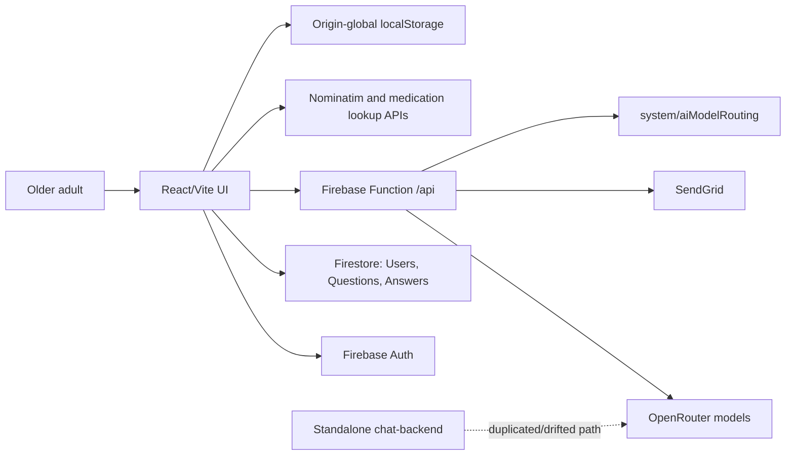
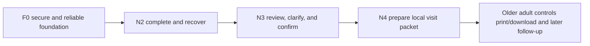

# AI Agent Capabilities Research and Roadmap

Prepared 2026-06-17. External sources were accessed 2026-06-17. Repository status labels describe code evidence, not deployment or compliance.

## 1. Executive Decision

Build a restrained three-capability portfolio over **12 months**, in this dependency order:

1. **Reliable Completion and Recovery Companion (N2):** deterministic save truth, exact resume, one-question mode, accessible recovery, and confirmed corrections. AI is optional and must not be marketed as the source of the core value.
2. **Source-Linked Review and Readback (N3):** deterministic readiness checks plus faithful, source-cited plain-language condensation of the older adult's own answers. The system corrects itself; it does not interpret health meaning.
3. **What-Matters-Led Visit Packet (N4):** an editable agenda led by a user-selected priority, with user-confirmed, source-linked patient-reported 4Ms responses, up to three user-approved questions, a fixed values/questions section, optional access/logistics notes, and local print/download.

The sequence is `secure foundation -> N2 -> N3 -> N4`. It creates one trustworthy assessment revision, one correction path, and one outward artifact. Every model-assisted step has a deterministic fallback. No selected feature diagnoses, changes medication behavior, scores decline, sends data to a caregiver or clinician, books anything, or uses recurring automation.

Do **not** add actions to the current chatbot. The present system has release-blocking authorization, privacy, consent, logging, save-reliability, scanner, and prompt-injection defects. Complete the shared foundation and independent security/privacy/clinical gates before any real-user L2/L3 pilot.

The assumed team is two full-time experienced engineers, a 0.5 FTE product/accessibility designer, a 0.25 FTE geriatric clinical-safety lead, a 0.25 FTE older-adult UX researcher, shared QA, and scheduled privacy/security/legal review. The 12-month choice reflects 22-33 engineer-weeks of foundation work, 15-24 incremental engineer-weeks for N2-N4, co-design, accessibility and security verification, pilot evaluation, and contingency. It is not a promise of clinical efficacy.

**Lead decision versus Portfolio Judge:** agree on N2, N3, and N4 and the dependency sequence. The judge ranked N4 slightly above N3 on total value; implementation still puts N3 first because N4 depends on N3's provenance and correction contract. N8 reminders rank fourth but are deferred rather than selected because they add a separate notification foundation and another confirmation surface before core value is proven.

## 2. Repository and Current-AI Assessment

### Runtime truth

| Claim | Status | Evidence and consequence |
|---|---|---|
| Guided four-domain assessment | **Implemented** | What Matters, Medication, Mentation (`mind`), and Mobility are rendered from `Questions/4ms_health`; answers live in `Answers/{uid}_4ms_health` (`src/services/questionnaireService.js:160-266,337-410`). |
| Autosave | **Documented only** | The UI changes local state and saves only through explicit Save/review actions (`src/views/Questionnaire/Questionnaire.jsx:142-165,177-205`). |
| Submit/completion workflow | **Partially implemented** | `completeSession` exists but Review exposes only Save and never calls it (`src/services/questionnaireService.js:448-459`; `src/views/Questionnaire/ReviewSubmit.jsx:375-397`). |
| Caregiver email | **Implemented as profile data** | Signup/profile store it, but the current questionnaire has no caregiver-send control (`src/views/Signup/Signup.jsx:385-418`; `src/components/ProfileModal.jsx:65-71`). |
| Daily medication/mobility email | **Implemented, unsafe default** | Scheduled Functions send to profile, caregiver, and Auth emails without active opt-in, preferences, quiet hours, or revocation (`functions/index.js:111-127,156-211,552-557`). |
| AI chat and quick questions | **Implemented, L0/L1 only** | Full chat history, questionnaire context, and optional reverse-geocoded location go to `/api/chat`; quick questions are generated and stored (`src/components/AIChatbot.jsx:518-570,744-766`). |
| AI actions/tools | **Not implemented** | There is no server-authorized tool registry, confirmation token, action audit, idempotency, undo, or delegated permission model. |
| Medication scan | **Partially implemented** | Camera lookup uses FDA/RxNorm and third-party UPC sources, but a non-medication match can be announced as a medication (`src/services/drugLookupService.js:151-198`; `src/components/MedicationScanner.jsx:137-141`). |
| Production readiness/compliance | **Unknown** | Code inspection cannot establish deployed versions, provider contracts, legal applicability, clinical validation, or monitoring. |

### Purpose, stakeholders, and current journeys

- **Implemented:** The product supports an older adult or participant completing a four-domain self-report assessment, reviewing/editing it, and exporting it (`src/views/Questionnaire/Questionnaire.jsx:19-52`; `src/views/Questionnaire/ReviewSubmit.jsx:174-255,348-410`).
- **Implemented:** Authentication/profile journeys cover signup, sign-in by email/username, password reset, profile editing, and logout. Firebase Auth is the identity provider and `Users/{uid}` is the profile record (`src/services/authService.js:98-201`; `src/components/AppLayout.jsx:45-99`; `src/components/ProfileModal.jsx:19-73`).
- **Implemented:** The AI journey is a separate assistant route with local history, quick questions, speech input, optional location, and questionnaire context (`src/App.jsx:35-39`; `src/components/AIChatbot.jsx:44-89,267-305,518-570,744-766`). It currently answers but cannot perform authorized product actions.
- **Partially implemented:** A caregiver is a profile email/automatic email recipient, not an authenticated, permission-scoped stakeholder. A clinician has no account/role/work queue; any clinician use is through a user-controlled exported report.
- **Documented only:** README journeys for autosave, caregiver-tip UI, and Submit Assessment are stale (`README.md:34-41,254-268`).
- **Inferred:** Other stakeholders needed for a responsible product are a geriatric clinical-safety owner, pharmacist advisor for medication work, accessibility/UX researchers, privacy/security/legal reviewers, operations/support, and any future clinician/caregiver partner. None is represented as an application role today.

### Complete current data/output inventory

| Data/output | Status and fields | Storage/recipient/device | Evidence |
|---|---|---|---|
| Auth identity | **Implemented:** Firebase UID, email, display name, email-verification/password-reset state | Firebase Auth; verification/reset email | `src/services/authService.js:98-201`; `src/views/login/Signin.jsx` |
| User profile | **Implemented:** first name, last name, email, phone, username, age, optional caregiver email, createdAt; some legacy records may differ | `Users/{uid}` | `src/services/authService.js:98-152,178-201`; `src/views/Signup/Signup.jsx:385-418` |
| Questionnaire schema | **Implemented:** name/version/active flag, four sections, question text/type/tags/options/tips | `Questions/4ms_health`; client may seed/migrate it | `src/services/questionnaireService.js:160-266` |
| Assessment | **Implemented:** userId, questionnaireId, status, responses for matters/medication/mind/mobility, createdAt/updatedAt | `Answers/{uid}_4ms_health` | `src/services/questionnaireService.js:337-410` |
| Response fields | **Implemented:** selected tags, free text, 1-10 happiness/memory/sleep ratings, mobility type/aids/challenges/fall concerns, medication category/name/dose/frequency/notes | Answer response maps | `src/services/questionnaireService.js:56-82,187-250`; `src/views/Questionnaire/4msSection.jsx:183-260` |
| AI context | **Implemented:** userId, completed section labels, formatted answer text; caregiver email omitted | Browser -> Function -> OpenRouter | `src/services/questionnaireService.js:554-668` |
| Chat/cache | **Implemented:** role/content/timestamp history, quick questions/timestamps, location-enabled preference | Origin-global `localStorage`; quick questions also in Answer document | `src/components/AIChatbot.jsx:45-65,100-129,307-410,460-463` |
| Location | **Implemented:** browser coordinates reverse-geocoded to an address string | Coordinates -> Nominatim; address -> chat model when enabled | `src/components/AIChatbot.jsx:473-516` |
| Medication lookup | **Implemented with safety gap:** numeric code, FDA/RxNorm/UPC/Open Food Facts result, brand/generic/form/strength/manufacturer/source | Browser and third-party APIs; result populates user entry | `src/services/drugLookupService.js:1-210`; `src/components/MedicationScanner.jsx:87-149` |
| User outputs | **Implemented:** progress/status UI, review cards, plaintext report, print dialog, native OS share, chatbot text, quick questions | Screen/device/local file/user-selected OS target | `src/views/Questionnaire/ReviewSubmit.jsx:174-255,348-410`; `src/components/AIChatbot.jsx:565-570` |
| Email outputs | **Implemented:** mobility tip and medication/mobility reminder content | SendGrid to profile/caregiver/Auth email | `functions/index.js:111-127,156-211,253-293` |
| Routing/operations | **Implemented:** provider tier, circuit state, failures, free/paid success counters | `system/aiModelRouting` and server logs | `functions/aiModelRouter.js:15-26,119-160,448-463` |

### Current data and device surface

**Implemented:** Current inputs include tags and free text; happiness, memory-concern, and sleep ratings; mobility type/aids/challenges/fall concerns; structured medication category/name/dose/frequency/notes; profile data and optional caregiver email. Browser features include speech recognition/synthesis, camera scanning, geolocation/Nominatim reverse geocoding, native share, print, and plaintext download (`src/views/Questionnaire/4msSection.jsx:122-695`; `src/components/AIChatbot.jsx:187-265,473-516`; `src/components/SpeechReader.jsx:8-55`). **Unknown for production:** the repository does not demonstrate a deployment-level geocoding policy or capacity agreement; production use would have to follow the [Nominatim Usage Policy](https://operations.osmfoundation.org/policies/nominatim/).

**Implemented:** Sensitive flows include questionnaire/chat/location data to OpenRouter, coordinates to Nominatim, codes to openFDA/RxNorm/UPC services, and health summaries to SendGrid (`src/components/AIChatbot.jsx:473-570`; `src/services/drugLookupService.js:1-210`; `functions/index.js:50-80,111-127`). Chat, quick-question cache, and location preference are stored in origin-global `localStorage`, not scoped to a signed-in user (`src/components/AIChatbot.jsx:45-65,78-81,460-463`). Caregiver email is deliberately excluded from AI context (`src/services/questionnaireService.js:619-625`).

### Current AI and architecture



**Implemented:** Firebase Hosting rewrites `/api/**` to the Function and otherwise serves the SPA (`firebase.json:25-48`). The standalone `chat-backend/server.js` duplicates chat, quick-question, reminder, and email code, while `functions/index.js` adds a persistent free-first/paid-fallback model router (`chat-backend/server.js:22-236`; `functions/index.js:26-293`; `functions/aiModelRouter.js:15-26,166-176,320-445`). **Inferred design requirement:** because the implementations differ, deployment ownership must be established and the supported path consolidated before feature work.

**Implemented with safety/security gaps:** The Function directly interpolates questionnaire free text into a system message and calls the model a “medical advisor” (`functions/index.js:50-80`). It lacks a deterministic emergency/medical policy. The 15-second limit is client-only (`src/components/AIChatbot.jsx:533-535`). CORS reflects arbitrary origins, APIs do not verify Firebase ID tokens, prompt fragments and sensitive context are logged/returned, and a credential-like token is committed in `AI_SETUP.md:34` (**value redacted; revoke and scrub history**).

**Implemented with release-blocking gaps:** `firebase.json` deploys `firebase-security-rules.txt`, which permits public `Users` reads/listing. Its recursive authenticated catch-all also overlaps `Users`, so any authenticated user can write/delete any profile, manipulate caregiver email/recipients, access another user's Answers, write Questions, and reach `system/aiModelRouting` (`firebase.json:19-22`; `firebase-security-rules.txt:5-15`). The unused `firestore-rules-only.txt` is narrower but still inadequate. `saveSectionResponses` catches errors without rethrowing, so the UI may claim success after a failed save (`src/services/questionnaireService.js:428-442`; `src/views/Questionnaire/Questionnaire.jsx:142-164`). **Inferred release decision:** these defects make the current system an unsafe execution substrate.

### Current accessibility assessment

| Provision/gap | Classification | Evidence |
|---|---|---|
| Section-heading focus, keyboard buttons, `aria-pressed`, large controls, status regions, responsive drawer | **Implemented** | `src/views/Questionnaire/Questionnaire.jsx:54-56,266-279`; `src/views/Questionnaire/4msSection.jsx:79-120`; `src/components/AppLayout.jsx:120-239` |
| Speech input and slower read-aloud with typed/visible fallback | **Implemented** | `src/views/Questionnaire/4msSection.jsx:264-360`; `src/components/SpeechReader.jsx:8-92` |
| Edit links from Review, print/download, and native share cancellation handling | **Implemented** | `src/views/Questionnaire/ReviewSubmit.jsx:219-255,295-340` |
| Programmatic labels/descriptions for all medication fields | **Partially implemented:** visible descriptors are not consistently associated with inputs | `src/views/Questionnaire/4msSection.jsx:469-498` |
| Scanner failure recovery | **Partially implemented:** several camera errors are deliberately hidden from the user | `src/components/MedicationScanner.jsx:174-180` |
| Speech synthesis lifecycle | **Partially implemented:** voice-loading retry has no terminal bound/unmount cancellation | `src/components/SpeechReader.jsx:37-55` |
| WCAG 2.2 AA, screen reader, 400% reflow, hearing, cognitive, low-literacy, and older-adult usability evidence | **Unknown:** no conformance report or study artifacts found | Repository-wide inspection |

### Reusable assets and blockers

**Implemented reusable assets:** generic questionnaire rendering and accessible choice buttons (`src/views/Questionnaire/4msSection.jsx:79-695`); schema/context and assessment services (`src/services/questionnaireService.js:160-668`); review/edit/report controls (`src/views/Questionnaire/ReviewSubmit.jsx:174-410`); speech controls (`src/components/SpeechReader.jsx:8-92`); structured medication UI (`src/views/Questionnaire/4msSection.jsx:420-536`); Firebase Auth/Firestore/Functions and scheduled triggers (`src/services/authService.js:98-201`; `functions/index.js:552-557`); SendGrid and OpenRouter routing adapters (`functions/index.js:15-25`; `functions/aiModelRouter.js:15-26,320-445`).

**Inferred prerequisites from the documented gaps:** owner-scoped rules, authenticated/authorized APIs, secret rotation, redacted logging, user-scoped storage, explicit consent, save truth, scanner truth, backend consolidation, typed actions, structured validation, revision checks, idempotency, audit/undo, retention/delete/export, prompt-injection separation, emergency boundaries, automated tests, and older-adult accessibility validation. Their evidence is the runtime/security findings above plus the absence of those controls from the current action surface; Gate A tests them rather than treating inference as proof.

## 3. Older-Adult Needs and Evidence Base

The 4Ms are What Matters, Medication, Mentation, and Mobility; age-friendly care is intended to align with what matters and cause no harm ([IHI Age-Friendly Health Systems](https://www.ihi.org/partner/initiatives/age-friendly-health-systems)). The app should therefore help an older adult express priorities and prepare a conversation, not impersonate a clinician.

WCAG 2.2 is the minimum technical baseline, including visible focus, target size, consistent help, redundant-entry reduction, error prevention, and accessible authentication ([WCAG 2.2](https://www.w3.org/TR/WCAG22/)). W3C treats many older-user needs as overlapping with disability access and recommends involving older people and people with disabilities in design/testing ([WAI Older Users](https://www.w3.org/WAI/older-users/)). Cognitive-accessibility guidance supports clear purpose, familiar language, feedback, memory support, and reversible error recovery ([W3C COGA guidance](https://www.w3.org/TR/coga-usable/)). These are product requirements, not AI features.

Recent systematic reviews report that limited digital literacy, physical/cognitive challenges, infrastructure, usability, privacy concerns, and mistrust can impede adoption; tailored training, accessible design, hybrid support, and co-design can facilitate it ([updated review, PMID 40934502](https://pubmed.ncbi.nlm.nih.gov/40934502/)). A 2025 review similarly identifies simplified navigation, larger targets/text, error tolerance, voice options, and participatory design, without proving AI-specific benefit ([PMID 40804492](https://pubmed.ncbi.nlm.nih.gov/40804492/)). Voice is therefore optional: it can reduce motor burden for some people but raises recognition, hearing, privacy, and correction burdens for others. Every action must have an equivalent visible text/touch/keyboard path.

Plain language and teach-back evidence support short explanations and read-back, but the app should test its own fidelity rather than test the older adult ([CDC Plain Language](https://www.cdc.gov/health-literacy/php/develop-materials/plain-language.html); [AHRQ Teach-Back](https://www.ahrq.gov/health-literacy/improve/precautions/tool5.html)). Health literacy is also an organizational responsibility, not a deficit to infer in a user ([Healthy People 2030](https://odphp.health.gov/healthypeople/priority-areas/health-literacy-healthy-people-2030)). Reviews of older adults with multimorbidity report both communication/self-management benefit and technology/support burden ([PMID 40387399](https://pubmed.ncbi.nlm.nih.gov/40387399/)); evidence for voice agents in memory impairment remains small and short-term ([PMID 35468084](https://pubmed.ncbi.nlm.nih.gov/35468084/)). WHO's health-AI guidance emphasizes autonomy, safety, transparency, accountability, inclusiveness, and qualified governance; it does not validate this app's features ([WHO guidance on large multimodal models for health](https://www.who.int/publications/i/item/9789240084759)). The [NIST AI RMF](https://www.nist.gov/itl/ai-risk-management-framework), its Generative AI Profile, and OWASP prompt-injection guidance support layered controls, evaluation, least privilege, and treating external/user content as untrusted ([NIST AI 600-1](https://doi.org/10.6028/NIST.AI.600-1); [OWASP LLM Prompt Injection Prevention](https://cheatsheetseries.owasp.org/cheatsheets/LLM_Prompt_Injection_Prevention_Cheat_Sheet.html)).

**Evidence boundary:** research supports accessible, low-burden, user-controlled design. It does not show that N1-N12 improve completion, comprehension, care, or health outcomes in this app. AI-specific benefits below are testable product hypotheses.

## 4. Candidate Capability Catalog

All model inputs are untrusted data. Every feature retains typed/touch fallback, visible provenance, Cancel, and no automatic emergency/caregiver/clinician action.

### N1. Assisted Narrative-to-Form Draft

For a user with motor or typing burden, a typed/spoken account such as “I use a cane outdoors and stairs worry me” becomes one source-linked field proposal at a time. Semantic extraction is a genuine AI task; schema validation and writes are deterministic. Existing inputs are narrative, current schema, and answers; new data are source span, destination field, draft revision, approval, and idempotency key. L2 proposes; L3 writes only after per-field confirmation and verifies/records/undoes. MVP is typed What Matters/Mobility only; voice and Medication are excluded. Measure time, correction/wrong-field/undo rates, and parity by modality. **Decision: merge as a later experiment inside N2/N3.**

### N2. Guided Completion and Recovery Companion

For any user who wants less clutter or returns after interruption, it calculates remaining items and verified save state, then offers one-question mode, Keep as written, Not sure, Skip, Save and stop, or exact resume. Rules handle missing state, retries, and inactivity; a model may only interpret an explicit help request into an allowlisted option. L1 proposes and L3 performs reversible navigation/save after a visible choice. Store preference, checkpoint, revision, and save outcome per user; retain no covert behavioral profile. Measure successful saves/resumes, completion burden, dismissals, mode exits, and false-success rate. **Decision: select, with a deterministic MVP.**

### N3. Plain-Language Readback and Readiness Check

For a user reviewing answers, it lists deterministic missing/format/duplicate/conflict checks and may condense free text into short sentences that cite exact answer fields. AI is warranted only for faithful condensation and neutral clarification; a deterministic field report always exists. L0 summarizes; L1 asks; L2 drafts a correction; an L3 patch requires explicit before/after confirmation. New data are answer revision, source references, check results, draft disposition, and expiry. It never explains medical meaning or claims comprehension. Measure unsupported/altered facts (target zero), correction burden, review completion, and trust. **Decision: select.**

### N4. What-Matters-Led Visit Preparation Packet

For an older adult preparing for a visit, the user chooses the lead priority and included fields; the agent drafts one What Matters statement, user-confirmed source-linked patient-reported responses, up to three editable questions, fixed values/questions prompts, and optional user-entered access/logistics notes. AI can condense and draft questions; layout, source coverage, limits, and export are deterministic. L2 drafts; L3 creates a local artifact after full preview. Inputs are confirmed N3 data plus optional visit purpose/date; no calendar/EHR is required. Accessible HTML/plain text and large-print views are non-voice fallbacks. Measure fidelity, edits/removals, packet completion, local-export cancellations and disclosure comprehension, and reported visit preparedness. **Decision: select.**

### N5. Medication List Verification and Question Prep

Compares patient-entered details with a user-confirmed label/source, displays provenance, flags only factual incompleteness/mismatch, and drafts a pharmacist/clinician question. It never identifies a “correct” regimen or recommends a change. L2/L3 requires per-entry confirmation. Existing scanner semantics, dense comparison, and unavailable pharmacy/EHR truth make harm plausible. [FHIR](https://hl7.org/fhir/) and [CMS Blue Button 2.0](https://bluebutton.cms.gov/) are standards/APIs, not evidence that this app has a connected, current medication truth source. MVP would need a pharmacist-reviewed corpus, manual sources, and no OCR/EHR. Measure dangerous merge/split errors, unresolved states, and medication-behavior harm. **Decision: research/pilot only; safe missing-field/questions residue may appear in N3/N4.**

### N6. Longitudinal 4Ms Change Review

Compares two user-selected immutable snapshots, shows exact field-level differences and provenance, accepts annotations, and drafts a neutral change brief. Diffing is deterministic; optional summarization has little AI advantage. No decline/risk language or hidden alert is permitted. It needs snapshot/version infrastructure the repository lacks. Measure diff accuracy, anxiety/confusion, annotation use, and packet value after repeated assessments. **Decision: defer until real longitudinal data exist.**

### N7. Consent-Governed Care Circle Task

Turns an explicit support request into a least-privilege, time-limited task for a verified person, with exact field/permission preview, propose-only edits, owner approval, audit, and revoke. Authorization is deterministic; AI only drafts task language. A profile caregiver email is not consent. Coercion, abuse, shared-device, identity, capacity, and representative-authority risks require a separate program. **Decision: withdraw from the production roadmap; research prototype only after legal/safeguarding/accessibility gates.**

### N8. What-Matters Goal and Reminder Steward

The safe residue is a one-time, privacy-safe reminder to resume the assessment or review a packet. Natural language may prefill a deterministic date/time form; the user confirms absolute time, timezone, channel, and message. No medication-dose reminder, recurrence, adherence monitoring, caregiver copy, or nonresponse escalation. It needs a new consent-aware scheduler and delivery audit. **Decision: defer and later merge as shared N2/N4 infrastructure, not a standalone agent.**

### N9. After-Visit Follow-Through Organizer

Extracts administrative tasks from pasted source text, anchors each item to the source, and requires approval before checklist/reminder creation. The model can drop negation, dates, and conditions or operationalize clinical instructions, while OCR/EHR/portal integrations do not exist. MVP would be a clinician-authored administrative allowlist and harm-case study, not a closed-loop product. **Decision: research/pilot only.**

### N10. Local Support Navigator and Warm Handoff

Matches an explicit need and manual/coarse location to a curated, dated regional directory, then drafts minimal contact data for L3 confirmed outreach. AI ranking is secondary; the scarce asset is maintained, equitable service data and a human fallback. No such partner or operation exists, and rural/no-result harms could concentrate exclusion. **Decision: defer pending a funded one-region data/operations partnership.**

### N11. Door-to-Door Mobility Plan

The revised safe residue is a user-entered access/logistics checklist. External route, venue, transit, and weather data can be stale or incomplete and a polished output can imply safety. Evidence-backed falls interventions do not validate this app as a route or fall predictor ([USPSTF falls-prevention recommendation](https://www.uspreventiveservicestaskforce.org/uspstf/recommendation/falls-prevention-community-dwelling-older-adults-interventions)). Continuous tracking, fall detection, booking, or “safe route” claims are prohibited. **Decision: reject as a standalone AI feature; merge a fixed optional checklist into N4.**

### N12. Shared-Decision Conversation Builder

The safe residue is fixed neutral prompts separating “what matters to me” from “questions I want to ask.” Patient decision aids can improve some decision outcomes, but that evidence concerns governed aids, not model-invented options ([Cochrane review, PMID 38284415](https://pubmed.ncbi.nlm.nih.gov/38284415/)). Treatment comparison, options, risk calculation, recommendation, or consent are research-only and require a governed, complete decision aid. AI adds little to the generic version. **Decision: merge fixed prompts into N4; reject model-generated decision comparison for this roadmap.**

### Required-field ledger for all candidates

| ID | Primary user and concrete story | Required / optional inputs | Exact action and autonomy | Confirmation, handoff, emergency boundary | Repository approach; accessibility fallback | Risks, measurable outcome, MVP / later |
|---|---|---|---|---|---|---|
| N1 | User with typing burden describes cane/stairs once and corrects one proposed Mobility field. | **Req:** authenticated revision, typed narrative, schema. **Opt:** speech transcript, current answers, explicit language preference. | Observe narrative -> structured source-span mapping -> L2 one-field proposal -> explicit L3 patch -> read-back/audit/undo. | Per-field confirmation; no blanket approval, caregiver/clinician send, or emergency interpretation. Urgent policy suspends generation and preserves draft. | `FourMSection`, speech seam, secured Function, N2 patch tool. Editable transcript; text/touch/keyboard equal to voice. | Wrong mapping, speech bias, injection, review burden. Measure wrong-field/edit/undo/time parity. **MVP:** typed What Matters/Mobility. **Later:** voice/language only if study passes; Medication excluded. |
| N2 | Interrupted user returns to the exact unsaved/saved field and chooses one-question mode. | **Req:** owner, schema/revision, save result, active field. **Opt:** explicit help request and chosen presentation preferences. | Deterministic observe/state calculation -> L1 option -> explicit L3 reversible mode/save/patch -> verify revision -> receipt -> exact resume. | User chooses mode/change; Stop helping/Do not offer again; no profiling, caregiver handoff, auto-submit, or triage. | Refactor `Questionnaire.jsx`; make service errors propagate; authenticated revision tools. Full form and fixed help always available without AI. | False save, mode confusion, repeated prompts. Measure false-save/resume/completion/dismiss/exit/undo. **MVP:** deterministic. **Later:** allowlisted explicit-request parser and N1 experiment. |
| N3 | Reviewer sees “walker at home,” opens cited source, corrects it to outdoors, or keeps original words. | **Req:** one verified revision and schema. **Opt:** free text, chosen detail/language/audio preference and model-processing opt-in. | Rules create checks; optional L0 source-linked draft; L1 one clarification; L2 correction; N2 L3 patch after confirmation; invalidate stale draft. | Keep my words/Skip/Do not ask again/Cancel. No clinical meaning or handoff. Urgent policy suspends model draft, not source access. | `ReviewSubmit.jsx`, validators, provenance schema, pinned structured model. Original deterministic review, visible sources, print/read-aloud/keyboard paths. | Omission, emphasis distortion, false reassurance, extra burden. Measure support/omission/alteration/correction/time. **MVP:** deterministic plus bounded What Matters/Mobility study. **Later:** other nonclinical text only after evidence. |
| N4 | User selects independence, edits three visit questions, excludes a memory note, and downloads a local large-print packet. | **Req:** N3-confirmed revision, selected priority/fields. **Opt:** visit purpose/date, user questions, access/logistics notes, model opt-in. | Observe confirmed fields -> L2 bounded packet draft -> full preview/edit -> explicit L3 local print/download -> render verification/receipt. | Preview is final confirmation; Cancel creates nothing. No external send/handoff in MVP. Urgent help is separate and never buried in a future packet. | Extend `ReviewSubmit.jsx`; source validator; client-side HTML/plain text renderer. Large print, semantic preview, keyboard reorder, deterministic template. | Omission, disclosure through local copy, steering, inaccessible print. Measure source fidelity/edits/exclusions/cancel/visit-prep use. **MVP:** local packet. **Later:** no destination integration without a new program. |
| N5 | Person compares an entered bottle name with a manually confirmed label and drafts “Which dose should I discuss?” | **Req:** user-entered medication record and user-confirmed source/provenance. **Opt:** repaired barcode lookup; later OCR/EHR/pharmacy sources. | Deterministic missing/mismatch display; optional L2 neutral question; L3 user-approved record correction. Never arbitrate source truth. | Per-entry confirmation; pharmacist/clinician handoff is a user-controlled artifact only. No dose advice or emergency classification. | Rebuild medication provenance and server lookup adapters; manual input fallback; accessible stacked comparison instead of dense table. | Misidentification/behavior change and accessibility burden. Measure dangerous merge/split/unresolved/no-harm. **MVP:** pharmacist-supervised study. **Later:** one read-only integration after validation. |
| N6 | Repeat user selects two assessment dates and annotates an exact change for the next visit. | **Req:** two compatible immutable snapshots. **Opt:** user annotation/selected changes. | Deterministic L0 diff -> L1 neutral explanation -> L2 annotation/export proposal -> L3 save/export. | User selects both snapshots and included changes; no alerts, caregiver send, risk/decline claims, or emergency inference. | New snapshot/diff UI and transaction service; print/list fallback; no model required. | Anxiety, schema drift, indefinite retention. Measure diff accuracy, exclusions, annotations, repeated value. **MVP:** exact user-initiated diff after data exists. **Later:** N4 inclusion only. |
| N7 | Older adult asks a daughter to propose medication spelling corrections for seven days while memory answers remain private. | **Req:** verified identities, explicit task/scope/expiry. **Opt:** custom message and later recurring grant. | L2 least-privilege task draft -> separate recipient/scope confirmation -> L3 invite -> supporter proposes -> owner L3 accepts/rejects -> audit/revoke. | Caregiver email alone grants nothing; no emergency alert. Representative authority and coercion are policy/human decisions, never model decisions. | New roles/grants/invites/rules/support surfaces; equally accessible owner/supporter UI and private revoke channel. | Coercion, abuse, impersonation, oversharing. Measure permission comprehension/revocation/rejected edits/incidents. **MVP:** research prototype only. **Later:** separate funded program. |
| N8 | User asks for one reminder tomorrow to resume, changes 9 AM to 10 AM, confirms, then deletes it. | **Req:** explicit request, timezone, channel, purpose. **Opt:** natural-language time prefill and quiet hours. | L2 exact absolute-time/message preview -> L3 schedule after approval -> delivery verification -> pause/delete; L4 recurrence excluded. | Separate confirmation; no caregiver copy, medication reminder, nonresponse escalation, or emergency monitoring. | Replace unsafe scheduler with authenticated F1 service; accessible date/time source of truth and non-notification path. | Wrong time, duplicate, alert fatigue, lock-screen disclosure. Measure edits/quiet-hour/duplicates/delete/resume. **MVP:** deferred one-time utility. **Later:** recurrence only after separate evidence. |
| N9 | User pastes an after-visit note; agent proposes “call imaging office” while leaving a medication sentence untouched. | **Req:** pasted source and governed administrative allowlist. **Opt:** later OCR/EHR import. | L2 source-anchored administrative task draft -> item approval -> L3 checklist; reminder only after F1. | Clinical/medication text is not operationalized; no caregiver/clinician send or emergency inference. | New source/task records and extraction service; original text always visible; manual checklist fallback. | Lost negation/date/condition and clinical-task confusion. Measure dangerous operationalization/omission/review burden. **MVP:** harm-case study. **Later:** governed import only. |
| N10 | Rural user enters ZIP and need; agent shows dated accessible-channel resources or admits no covered result. | **Req:** explicit need, manual/coarse location, maintained directory. **Opt:** call/email draft. | L1 sourced match -> L2 minimal contact draft -> L3 contact only after exact service/recipient/data confirmation. | No background location, auto-booking, or emergency substitution; human fallback required. | Curated regional ingestion/search adapters; manual ZIP and phone/copy fallback; source date/eligibility visible. | Stale/unequal coverage and false eligibility. Measure no-result/freshness/reach by geography/channel. **MVP:** one funded region pilot. **Later:** expand only with operations. |
| N11 | User manually records entrance/seating/transport questions for a visit. | **Req:** destination/access preferences entered by user. **Opt:** later external venue/transit/weather facts. | L2 checklist draft -> L3 local artifact after review. No route safety claim or booking. | No tracking, automatic caregiver alert, emergency service, purchase, or “safe route.” | Fixed optional N4 checklist; touch/keyboard/print fallback. | Polished false safety and narrow value. Measure edits/usefulness/data error. **MVP:** deterministic N4 section. **Later:** external version rejected pending evidence. |
| N12 | User records what matters and up to three questions without receiving a treatment recommendation. | **Req:** user-selected values/questions. **Opt:** future governed decision-aid source. | L0 fixed prompts/L1 organization/L2 worksheet; no treatment comparison action. | No recommendation, consent, clinician send, individualized risk, or emergency inference. | Fixed N4 worksheet using existing form/report controls; plain-language text/print/read-aloud. | Framing/steering and duplicated interface. Measure edits/understanding/priority use. **MVP:** fixed prompts in N4. **Later:** decision-specific research only. |

Explicit non-candidates are diagnosis/risk prediction, medication changes, autonomous emergency triage, voice-based mood/cognition inference, passive gait/fall prediction, always-on location/caregiver surveillance, unverified web-resource search, autonomous EHR messaging/booking/purchases, emotion/avatar companions, streaks/badges, synthetic family voices, and digital-twin/decline scores.

## 5. Persona Council Findings

The Council used eight evidence-informed design lenses, not claims to speak for all older adults.

| Lens | Main benefit test | Main exclusion/harm test | Required adjustment |
|---|---|---|---|
| P1 Tech-comfortable, several medications | Speed, provenance, useful visit output | Overconfident “verification” or repetitive confirmations | Compact expert path; unresolved medication state; no regimen advice |
| P2 Low vision/fine-motor limits | Fewer gestures, large targets, exact resume | Dense diffs, drag-only controls, voice correction burden | 400% reflow, semantic structure, large controls, reorder buttons |
| P3 Hearing loss | Complete visible workflow | Audio-only prompts/status/confirmation | Captions/transcript, text/touch parity, no sound-only alerts |
| P4 Mild cognitive impairment/high memory burden | One step, source links, stable resume | Too many derived items, mode changes, hidden consequences | One-item option, plain before/after, persistent Cancel/Undo |
| P5 Low health/technology literacy | Plain language, fixed choices, local artifact | Jargon, “verified” claims, consent comprehension burden | Familiar wording, examples, comprehension-focused co-design |
| P6 Rural/low-income/intermittent connectivity | Low-bandwidth recovery and model-independent templates when Firebase is reachable | Provider/network dependence, stale local service data | Truthful unsaved state, retry/resume, local print after data loads; no false offline promise |
| P7 Privacy-preferring | Local preview/export and granular inclusion | Location, caregiver, or background disclosure | Default-private, minimal data, visible retention/delete controls |
| P8 Authorized caregiver | Bounded tasks can help | Role displacement, coercion, oversharing | Older-adult owner control; no caregiver feature in selected MVP |

### Candidate-by-candidate council resolution

| ID | Who benefits | Who may be excluded or harmed | Friction that remains | Required design adjustment |
|---|---|---|---|---|
| N1 | People with typing/motor burden or cross-field narratives | Speech-recognition errors, hearing/privacy constraints, high correction burden | Transcript plus proposal review may exceed direct entry | Typed MVP, one field at a time, editable source span, adjacent ordinary form, remove if no burden benefit |
| N2 | All eight lenses, especially interrupted/high-memory-burden users | Users annoyed by unsolicited adaptation or disoriented by mode changes | Choosing a mode and trusting save state | User-invoked/default-fixed help, persistent Stop helping/Do not offer again, precise save/read-back |
| N3 | Low-literacy/high-memory-burden users and anyone finding an app mistake | Summaries can omit nuance or sound clinically authoritative | Comparing original and draft | One item at a time, Keep my words/Skip, source links, deterministic report, zero-tolerance fidelity gate |
| N4 | Users preparing to raise priorities; low-bandwidth users who need print | Sensitive inclusion, inaccessible print, packet mistaken for clinical review | Selecting fields and editing questions | Local-only artifact, user-selected lead priority, large print/plain text, “not reviewed by clinic” label |
| N5 | People managing several medicines | Low vision/cognition burden; all users harmed by false reconciliation | Dense provenance comparison and unresolved discrepancies | Stacked accessible view, pharmacist supervision, unresolved-not-verified language, no behavior advice |
| N6 | Repeat users preparing a change conversation | New users with no history; anxious users interpreting change as decline | Selecting comparable snapshots and schema changes | User-initiated exact diffs, neutral language, no trend/risk, explain unavailable history |
| N7 | Authorized support relationships with a narrow task | Privacy-preferring users; people exposed to coercion/abuse/shared devices | Complex consent, identity, private revocation | Separate research program with accessible permission examples, short expiry, read/propose only, owner approval |
| N8 | Users who choose a routine cue or have high memory burden | Shared-device/lock-screen privacy and alert fatigue; intermittent delivery | Exact time/timezone/channel confirmation | One-time/default-private reminder, accessible picker, quiet hours, dedupe, pause/delete; defer from MVP |
| N9 | Users with a clear administrative after-visit instruction | Low literacy or clinical-text ambiguity can convert meaning dangerously | Pasting and checking the source | Original text adjacent, administrative allowlist, no clinical operationalization, controlled study only |
| N10 | Users with unmet transport/social support needs | Rural/low-income users most harmed by no results or inaccessible channels | Eligibility, calling, stale directory | Region-specific funded data, visible freshness, manual ZIP, human fallback, equity metrics |
| N11 | Users with mobility/access logistics questions | Users who read a checklist as a safe route; regions with poor data | Manual fact entry may erase AI benefit | Fixed N4 access checklist only; no external route claim, tracking, or booking |
| N12 | Users who want a values/questions prompt | Low-literacy users may hear model framing as recommendation | Separating values from evidence/options | Fixed neutral N4 prompts; no treatment comparison or individualized risk outside governed research |

Council scores are 1-5; total is a simple six-criterion diagnostic (maximum 30), not the weighted portfolio rubric.

| ID | Usefulness | Ease | Inclusion | Autonomy | Trust | Repeat value | /30 |
|---|---:|---:|---:|---:|---:|---:|---:|
| N1 | 4 | 3 | 3 | 4 | 3 | 4 | 21 |
| N2 | 5 | 5 | 5 | 5 | 5 | 5 | 30 |
| N3 | 5 | 4 | 5 | 5 | 4 | 5 | 28 |
| N4 | 5 | 4 | 5 | 5 | 4 | 5 | 28 |
| N5 | 5 | 3 | 3 | 4 | 3 | 5 | 23 |
| N6 | 4 | 4 | 4 | 5 | 4 | 4 | 25 |
| N7 | 3 | 2 | 3 | 4 | 3 | 4 | 19 |
| N8 | 4 | 4 | 4 | 5 | 4 | 5 | 26 |
| N9 | 4 | 3 | 3 | 4 | 3 | 4 | 21 |
| N10 | 4 | 3 | 3 | 4 | 3 | 4 | 21 |
| N11 | 3 | 3 | 3 | 4 | 3 | 3 | 19 |
| N12 | 3 | 3 | 3 | 5 | 3 | 3 | 20 |

### First-person walkthroughs

**N2:** “I choose one question at a time. After my Wi-Fi drops, the screen says the last change is not saved; it does not pretend. I choose Retry, then see the exact saved time. I accidentally enter the wrong section, press Back, and return to the same field. I choose Save and stop, cancel once when I notice an unfinished note, then save and later resume at that note.”

**N3:** “The readback says I use a walker at home, but I entered outdoors. I open the cited Mobility answer, change it, preview the before/after value, and confirm. I reject a suggested wording that feels wrong and choose Keep my words. The summary regenerates only that sentence. If the AI is unavailable, I still see every original answer and readiness check.”

**N4:** “I select staying independent as my lead priority. The packet drafts three questions; I remove one and rewrite another. I press Create, inspect the full large-print preview, then Cancel because a memory note is included. I exclude it, create again, and download locally. Nothing is emailed. If generation fails, the fixed template still contains the fields I approved.”

## 6. Engineering Feasibility Analysis

Estimates assume an experienced React/Firebase team. One engineer-week (EW) is five focused days including code review, tests, touched-flow accessibility, deployment, and modest defect allowance. Formal clinical/legal review, recruiting, and prospective research are outside EW. Size bands: S 1-3, M 4-7, L 8-14, XL 15-28 EW.

### Shared work counted once

| Foundation | Scope | Estimate |
|---|---|---:|
| F0 Secure/reliable agent foundation | Rules/API auth, secret/log/storage remediation, backend consolidation, save/scanner truth, revision model, typed tools, action receipts, structured output validation, injection controls, audit/undo, tests/observability/feature flags | **XL, 22-33 EW** |
| F1 Notification service | Consent/preferences, one channel, timezone/quiet hours, idempotent scheduling/cancel/delivery audit | **M/L, 5-8 EW**; deferred |
| F2 Delegation platform | Identity, grants, invitations, scoped rules, revoke, safeguarding/support | **L, 8-12 EW** plus candidate work; not roadmap |
| F3 Governed-source ingestion | Source versioning, extraction anchors, content QA | **L, 8-12 EW**; research only |

### Candidate feasibility

| ID | Fit/data | Incremental effort after F0 | Key unknown/dependency | Feasibility decision |
|---|---|---:|---|---|
| N1 | Good; reuses form/dictation | L, 7-11 EW | Comparative burden and mapping-error spike | Bounded later experiment |
| N2 | Excellent | M, 4-7 EW | Save/conflict/network-recovery state design | Build first; deterministic |
| N3 | Strong | M/L, 6-9 EW | Source coverage and fidelity evaluation | Build first |
| N4 | Strong; reuses report/export | M, 5-8 EW | Accessible artifact and question-fidelity testing | Build after N3 |
| N5 | Moderate | L/XL, 10-16 EW | Pharmacist corpus; no pharmacy/EHR truth | Gated research |
| N6 | Good code fit, missing history | M/L, 6-10 EW | Two compatible immutable snapshots | Second wave |
| N7 | Moderate, major role change | 18-28 EW program incl. F2 | Authority, coercion, identity, support | Separate program |
| N8 | Good | 9-15 EW incl. F1 | Reliable channel/DST/cancel semantics | Defer/merge |
| N9 | Moderate | L, 8-13 EW plus F3/F1 later | Administrative/clinical classifier | Controlled study |
| N10 | Code fit, data poor | XL, 10-16 EW plus operations | Funded regional directory partner | Defer |
| N11 | Manual fit good | M, 4-7 EW; external 12-20 | Data completeness; little AI advantage | Checklist only in N4 |
| N12 | Generic fit good | M, 4-7 EW; specific 16-24 | Governed decision-aid catalog | Fixed N4 prompts only |

### Feasibility detail ledger

| ID | Frontend/backend/data/rules/orchestration/observability work | Deterministic constraint vs model | Availability, latency, cost/lock-in, offline, test, and maintenance burden |
|---|---|---|---|
| N1 | Proposal/transcript panel; structured extractor; draft/provenance fields; owner-only patch rules; action receipt and mapping metrics | Model only maps narrative; schema allowlist, field limits, revision, confirmation, write/undo are deterministic | One model call adds latency/cost and speech varies by browser; no offline promise; mapping/adversarial/subgroup corpus and model-regression upkeep are substantial |
| N2 | Questionnaire state machine; save API; revision/checkpoint/preferences; rules tests; save/conflict dashboards | Remaining items, help triggers, progress, save/resume are deterministic; model optional for explicit request enum | No model/vendor dependency in MVP; Firestore reachability still required for verified save; network/conflict/device/accessibility matrix is ongoing maintenance |
| N3 | Review/source UI; validators; draft/check collections; structured summary API; fidelity/fallback metrics | Missing/format/source display deterministic; model draft is unverified until user accepts and is removable | Model latency/cost/provider drift; deterministic review works during model outage but not full network outage; maintain harm/fidelity set and policy versions |
| N4 | Packet builder/renderer/print CSS; packet draft/export receipt; source validation; artifact metrics | Template, field inclusion, limits, rendering deterministic; model only optional condensation/question draft | No EHR/calendar/email dependency; model call optional; local file has post-download privacy risk; browsers/print engines need regression maintenance |
| N5 | Medication provenance/stacked comparison; server terminology adapters; revised rules; mismatch metrics | Missing/source mismatch deterministic; model may phrase a neutral question only | Public APIs have uptime/rate/term risk and no patient truth; no offline verified lookup; pharmacist corpus, API drift, and safety monitoring are expensive |
| N6 | Snapshot/diff UI; immutable revision schema/index; transactions/export; schema-compatibility metrics | Diff and compatibility are deterministic; model summary optional and likely unnecessary | No external vendor, but value unavailable until repeated data; storage/retention/schema migration and long-term compatibility are maintenance burdens |
| N7 | Owner/supporter apps; grants/invites/tasks; role/rules redesign; identity/receipt/revoke observability | Authorization/expiry/scope entirely deterministic; model only drafts task copy | Identity/email availability, support and abuse response dominate cost; shared-device tests, legal change, revocation races, and continuous safeguarding maintenance |
| N8 | Reminder preview/history; preferences/delivery records; authenticated scheduler/queue; delivery/cancel metrics | Date/time/channel/message approval and executor are deterministic; model may prefill only | Channel/DST/queue fees and vendor delivery uncertainty; no offline scheduling; duplicate/cancel/quiet-hour simulators and operational alerting required |
| N9 | Source/task reviewer; source/task/retention schema; extraction API; dangerous-operationalization metrics | Administrative allowlist/source anchors deterministic; model extraction required for proposed value | Model/OCR/EHR unavailable or high lock-in; paste-only still has latency/review burden; clinician harm corpus and source-version upkeep are ongoing |
| N10 | Directory/search/contact UI; versioned source ingestion/indexes; refresh/correction operations; coverage metrics | Eligibility constraints/freshness deterministic; model ranking/explanation optional | Highest non-code cost: contracts, regional coverage, stale data, call-channel availability; no useful offline freshness guarantee; human operations permanent |
| N11 | Checklist UI/packet section; external adapters only later; source timestamp metrics | Manual checklist deterministic; model adds little | Manual MVP has low cost; external maps/transit/weather introduce latency, fees, regional inequity, and continuous source-quality maintenance; therefore rejected |
| N12 | Fixed worksheet in packet; governed source catalog only in research; source/version metrics | Generic prompts deterministic; model option comparison prohibited | Generic version has no vendor cost; decision-specific content has large clinical/content maintenance, completeness, version, and steering-test burden |

Cloud costs are likely modest for the selected MVP compared with engineering/validation, but must be bounded: pin supported models, cap tokens and drafts, cache no health response across users, set per-user/server limits, record cost without content, and preserve deterministic fallback. Free-model rotation is inappropriate for a validated health-facing flow because behavior can change across providers. Provider retention/training terms require a documented review. **The current repository and selected MVP do not promise offline operation:** there is no service worker/IndexedDB sync design. If OpenRouter fails while Firebase remains reachable, N2 and deterministic N3/N4 paths continue; if the network/Firestore fails, N2 must preserve visible unsaved state and recovery rather than claim persistence. Durable offline sync is a separately estimated future capability.

## 7. Clinical Safety, Privacy, Security, and Ethics Review

No candidate is unconditionally approved. Dispositions assume F0 and named controls; they are not permission to extend today's chatbot.

| ID | Disposition | Controlling concern / required condition |
|---|---|---|
| N1 | **Proceed with mandatory safeguards** | Source spans, schema allowlist, per-field confirmation, no audio retention, injection isolation |
| N2 | **Proceed with mandatory safeguards** | Truthful save state, no behavioral/capacity inference, dismissible help, accessible recovery |
| N3 | **Proceed with mandatory safeguards** | Fail closed on unsupported facts; preserve negation/numbers/dates; no clinical meaning |
| N4 | **Proceed with mandatory safeguards** | User selects priority/content; full preview; local export; separate urgent-help path |
| N5 | **Research/pilot only** | Medication misidentification/behavior harm; pharmacist-reviewed evaluation required |
| N6 | **Proceed with mandatory safeguards** | Exact diffs only; no decline/risk language, alerts, or indefinite history |
| N7 | **Research/pilot only** | Coercion/abuse, identity, authority, capacity, revocation, private support channel |
| N8 | **Proceed with mandatory safeguards** | Consent-aware replacement scheduler; quiet hours, dedupe, delivery truth, pause/delete |
| N9 | **Research/pilot only** | Negation/condition loss can turn clinical text into dangerous tasks |
| N10 | **Research/pilot only** | Directory staleness, inequity, false eligibility, emergency substitution |
| N11 | **Research/pilot only** | Incomplete external facts may be mistaken for a safe route |
| N12 | **Research/pilot only** | Framing/steering and incomplete evidence in decision comparison |

### Candidate-specific safety and ethics ledger

| ID | Foreseeable harm/bias/autonomy risk | Consent, authorization, minimization, retention, injection/tool misuse | Human review, contraindicated action, escalation/stop condition |
|---|---|---|---|
| N1 | Fabricated/incorrect field, speech bias, sensitive narrative exposure, repeated confirmation | Owner-only current field subset; no audio retention; 24h draft; narrative is untrusted and cannot choose a field/tool without schema validation | Accessibility review and harm corpus; no Medication mapping or blanket approval; suspend model on urgent-policy trigger, auth/revision failure, or user cancel |
| N2 | False save, lost work, paternalistic “confusion” inference, mode disorientation | Explicit preferences only; minimal checkpoint; owner authorization/revision/idempotency; help text cannot mutate data | Accessibility/UX review; no capacity score, auto-submit, or hidden notification; stop offers after Stop helping/Do not offer again |
| N3 | Omission, softened urgency, altered attribution, false reassurance, literacy/language disparity | Just-in-time model-processing opt-in; minimum selected fields; short draft; answer text is untrusted; model cannot select actions | Clinical/plain-language/accessibility review; no diagnosis/risk/meaning; fail to extractive template on unsupported/omitted salient content or stale source |
| N4 | Priority distortion, sensitive inclusion, generated question steering, local-copy disclosure | Separate packet/model opt-in; user selects fields; no server file retention; no recipient/tool in output; packet text is sanitized untrusted content | Clinical/plain-language/print review; no send, treatment comparison, medication advice, safe-route claim; cancel or any unsupported fact stops creation |
| N5 | Wrong drug/source merge can change medication behavior; dense UI excludes some users | Per-source consent/provenance; minimum record; scan/label text untrusted; adapters cannot commit record changes | Pharmacist adjudication; no “verified/correct,” interaction/dose advice, or emergency reassurance; stop on ambiguity/identity mismatch |
| N6 | Change language causes anxiety or implies decline; long retention expands privacy risk | User selects snapshots/fields; explicit retention/delete; snapshot text cannot create alerts/tools | Clinical/plain-language review; no trend/risk/causal claim or hidden alert; stop on schema incompatibility |
| N7 | Coercion, elder abuse, impersonation, disputed authority, caregiver displacement | Separate verified identities, least scope/expiry, private revoke, immutable audit; message content cannot expand grants | Safeguarding/legal/human support; no model capacity/authority decision or emergency alert; stop on suspected coercion/dispute/shared-account ambiguity |
| N8 | Wrong/duplicate time, alert fatigue, lock-screen disclosure, adherence coercion | Purpose/channel/time consent; privacy-safe preview; dedupe/expiry/pause/delete; message cannot choose recipient/recurrence | Communications/privacy review; no medication/adherence/nonresponse escalation; stop on timezone/channel uncertainty or failed cancel verification |
| N9 | Lost negation/condition turns clinical instruction into dangerous task; document may contain third-party data | Explicit paste consent, source anchors, short retention; source is untrusted and cannot call a tool | Clinician-authored administrative allowlist; no medication/clinical operationalization; stop on any uncertain classification, missing source, or urgent text |
| N10 | Stale/false eligibility, unequal rural coverage, failed emergency substitution | Coarse/manual location consent; directory provenance/freshness; external text cannot choose contact action | Regional data owner/human navigator; no emergency routing or auto-booking; stop/show no-result when freshness/coverage fails |
| N11 | Route/checklist mistaken as safe; tracking/coercion | Manual minimum facts; no background location; external data untrusted | Mobility/accessibility review; no “safe,” fall prediction, booking, or auto-alert; standalone concept stopped/rejected |
| N12 | Framing, omitted options, perceived recommendation, capacity/consent confusion | User-entered values only in MVP; governed sources/versioning required later; source text cannot drive action | Clinical decision-aid/research review; no treatment comparison/risk/recommendation/consent; stop outside fixed neutral worksheet |

Mandatory controls include least privilege, Firebase ID-token verification, owner/action authorization on every call, no client-supplied user ID or recipient authority, proposal hashes/expiry, explicit labeled controls, revision checks, idempotency, visible action receipt, Undo where possible, redacted logs, user-scoped caches, purpose/retention fields, delete/export, rate/cost limits, provider-failure disclosure, evaluation for subgroup disparities, and incident response.

Questionnaire text, transcripts, model messages, scans/OCR, emails, directory data, and third-party responses are untrusted content. They cannot select tools, recipients, scopes, policy, urgency, or confirmation. Separate instructions from data, validate strict schemas/enums/lengths/source IDs, reject tool-like content, and reauthorize after the model. No model output may directly write Firestore or cause an external communication.

Clinically approved urgent-help copy must be available outside the model. The agent must stop health interpretation when it cannot preserve source meaning, when the assessment revision changed, when confirmation is ambiguous, when authorization/recipient identity fails, or when the user cancels. It must never reassure that an emergency is absent. Qualified clinical, privacy, security, accessibility, legal/regulatory, and research-ethics reviewers must address intended-use/CDS questions, HIPAA/FTC/state-law applicability, provider terms, health communications, safeguarding/representative authority, and whether pilots need IRB oversight. Code inspection does not establish compliance. Relevant baselines include [FDA CDS guidance](https://www.fda.gov/regulatory-information/search-fda-guidance-documents/clinical-decision-support-software) and the [FTC Health Breach Notification Rule](https://www.ftc.gov/legal-library/browse/rules/health-breach-notification-rule).

## 8. Red-Team Critique and Agent Rebuttals

| ID | Red-team decision | Attack and final narrowing |
|---|---|---|
| N1 | **Merge** | Confirmation may exceed direct-form burden; typed What Matters/Mobility experiment only after N2/N3 |
| N2 | **Keep** | Core is ordinary accessibility/reliability; say so and remove opaque adaptation |
| N3 | **Keep** | Fluent summaries can hide omissions; deterministic checks and source coverage are canonical |
| N4 | **Keep** | Avoid a polished clinical document; user-owned local agenda with full edit/preview |
| N5 | **Defer** | “Reconciliation” overclaims available truth; pharmacist-gated list-quality study only |
| N6 | **Defer** | No history and little agentic advantage; exact diff only after repeated snapshots |
| N7 | **Defer** | Granular consent does not solve coercion/authority/support; separate program |
| N8 | **Merge** | Scheduler, not AI; one-time shared utility later, no coaching/recurrence |
| N9 | **Defer** | A demo can silently operationalize clinical text; harm-case research first |
| N10 | **Defer** | Missing maintained directory/operations, not missing language generation |
| N11 | **Reject standalone** | Manual checklist has little AI value; external data can falsely imply safety; absorb into N4 |
| N12 | **Merge** | Fixed values/questions belong in N4; no generated options or risk comparison |

All four discovery specialists accepted the core criticism. Accessibility narrowed to deterministic N2, source-grounded N3/N4, merged N1/N8, and deferred delegation. The geriatric specialist kept N3/N4, merged fixed N12 prompts, deferred medication/change/after-visit work, and withdrew N7 from production. The workflow designer converged on three keeps, three merges, five deferrals, and one withdrawal. The innovation scout removed calendar/L4 automation, deferred high-risk/data-dependent ideas, and withdrew N11 as a standalone agent.

| Discovery specialist | Accepted objection | Attributable rebuttal/revision | Evidence relied on |
|---|---|---|---|
| Older-adult experience/accessibility | Voice/adaptation can add burden and many “AI” ideas are ordinary WCAG/reliability work | Make N2 deterministic; keep N3/N4 only with source/fallback; merge typed N1 and one-time N8 later; defer N7 | WCAG/COGA, older-adult adoption reviews, Persona Council burden results (`RESEARCH_PHASE5_REBUTTAL_ACCESSIBILITY.md`) |
| Geriatric 4Ms/workflow | Medication “verification,” longitudinal interpretation, caregiver delegation, and decision comparison overreach current evidence/roles | Keep readiness N3 and local N4; merge fixed values/questions; defer N5/N6/N9; withdraw N7 from production | IHI 4Ms, safety disposition, unavailable clinical truth/partners (`RESEARCH_PHASE5_REBUTTAL_GERIATRIC.md`) |
| Practical agent workflow | Multiple agents duplicate state/confirmation and hide deterministic alternatives | One canonical N2 revision/action path, N3 provenance layer, N4 artifact; merge N1/N8/N12; defer data/integration-heavy actions | Repository seams, engineering effort, red-team cumulative burden (`RESEARCH_PHASE5_REBUTTAL_WORKFLOW.md`) |
| Innovation scout | “Wow” external integrations are demos without dependable data and L4 is premature | Remove calendar/L4; accept N3 as canonical; defer N5/N6/N7/N9; withdraw N11 standalone | Data dependency map, safety/persona review, 6-12 month feasibility (`RESEARCH_PHASE5_REBUTTAL_INNOVATION.md`) |

The key rebuttal was not that AI is safer than the reviewers assumed. It was that a bounded model can still add value in semantic condensation/question drafting if source fidelity and comparative burden tests pass. The lead accepts that hypothesis only as an evaluated enhancement; deterministic versions ship and remain usable without it.

## 9. Scoring Method and Full Ranked Matrix

The weighted total is:

`Total = (U/5*20) + (A/5*12) + (D/5*10) + (S/5*15) + (F/5*12) + (E/5*12) + (G/5*8) + (M/5*6) + (W/5*5)`

U=older-adult usefulness, A=accessibility/inclusion, D=autonomy/dignity/trust/consent, S=safety appropriateness, F=current-app/data fit, E=6-12 month feasibility, G=agentic advantage, M=measurable value, W=responsible differentiation. Raw scores are 1-5. A Safety-review **Reject** would veto regardless of total; none received that disposition. Portfolio eligibility requires A, D, and S each at least 3 unless a directly corrective roadmap prerequisite is explicit.

| Rank | ID | U | A | D | S | F | E | G | M | W | Total | Safety/threshold | Ranking confidence; evidence basis; efficacy evidence |
|---:|---|---:|---:|---:|---:|---:|---:|---:|---:|---:|---:|---|---|
| 1 | N2 | 5 | 5 | 5 | 5 | 5 | 5 | 1 | 5 | 2 | **90.6** | Safeguards; pass | **High**; strong repo defect + standards evidence; **no direct efficacy evidence** |
| 2 | N4 | 5 | 5 | 5 | 4 | 5 | 4 | 3 | 4 | 4 | **89.2** | Safeguards; pass | **Medium**; current report seams + design evidence; **no direct efficacy evidence** |
| 3 | N3 | 5 | 5 | 5 | 4 | 5 | 4 | 2 | 5 | 3 | **87.8** | Safeguards; pass | **Medium**; current review seams + plain-language evidence; **no direct efficacy evidence** |
| 4 | N8 | 4 | 4 | 5 | 4 | 4 | 3 | 1 | 4 | 2 | **72.8** | Safeguards; pass | **Medium**; reminder workflow/design evidence; **no direct efficacy evidence here** |
| 5 | N1 | 3 | 3 | 4 | 3 | 4 | 3 | 4 | 4 | 4 | **68.2** | Safeguards; pass at floor | **Medium**; semantic-task rationale; **low, indirect outcome evidence** |
| 6 | N6 | 3 | 4 | 5 | 4 | 2 | 4 | 1 | 3 | 2 | **65.2** | Safeguards; pass, missing data | **Medium**; deterministic feasibility; **no app efficacy/history evidence** |
| 7 | N5 | 5 | 3 | 4 | 2 | 3 | 2 | 2 | 4 | 3 | **64.2** | Pilot; fails S | **Low**; medication need evidence but no product validation/truth source |
| 8 | N9 | 4 | 3 | 4 | 2 | 3 | 2 | 4 | 3 | 3 | **62.2** | Pilot; fails S | **Low**; plausible task-extraction value; **no safety/efficacy evidence** |
| 9 | N12 | 2 | 4 | 5 | 2 | 3 | 5 | 1 | 2 | 1 | **57.8** | Pilot; fails S | **Medium**; decision-aid evidence does not validate generated content |
| 10 | N10 | 4 | 2 | 4 | 2 | 1 | 1 | 3 | 3 | 4 | **52.0** | Pilot; fails A/S | **Low**; need is clear, directory/data evidence absent |
| 11 | N11 | 2 | 3 | 4 | 2 | 3 | 4 | 1 | 2 | 1 | **51.0** | Pilot; fails S; product reject | **Medium**; checklist feasibility, no route-agent efficacy evidence |
| 12 | N7 | 3 | 2 | 2 | 2 | 2 | 1 | 1 | 3 | 3 | **42.2** | Pilot; fails A/D/S | **Low**; caregiver need evidence, no safe delegation validation |

### Math ledger

- N2: `5/5*20 + 5/5*12 + 5/5*10 + 5/5*15 + 5/5*12 + 5/5*12 + 1/5*8 + 5/5*6 + 2/5*5 = 90.6`.
- N4: `5/5*20 + 5/5*12 + 5/5*10 + 4/5*15 + 5/5*12 + 4/5*12 + 3/5*8 + 4/5*6 + 4/5*5 = 89.2`.
- N3: `5/5*20 + 5/5*12 + 5/5*10 + 4/5*15 + 5/5*12 + 4/5*12 + 2/5*8 + 5/5*6 + 3/5*5 = 87.8`.
- N8: `4/5*20 + 4/5*12 + 5/5*10 + 4/5*15 + 4/5*12 + 3/5*12 + 1/5*8 + 4/5*6 + 2/5*5 = 72.8`.
- N1: `3/5*20 + 3/5*12 + 4/5*10 + 3/5*15 + 4/5*12 + 3/5*12 + 4/5*8 + 4/5*6 + 4/5*5 = 68.2`.
- N6: `3/5*20 + 4/5*12 + 5/5*10 + 4/5*15 + 2/5*12 + 4/5*12 + 1/5*8 + 3/5*6 + 2/5*5 = 65.2`.
- N5: `5/5*20 + 3/5*12 + 4/5*10 + 2/5*15 + 3/5*12 + 2/5*12 + 2/5*8 + 4/5*6 + 3/5*5 = 64.2`; no threshold exception.
- N9: `4/5*20 + 3/5*12 + 4/5*10 + 2/5*15 + 3/5*12 + 2/5*12 + 4/5*8 + 3/5*6 + 3/5*5 = 62.2`; no threshold exception.
- N12: `2/5*20 + 4/5*12 + 5/5*10 + 2/5*15 + 3/5*12 + 5/5*12 + 1/5*8 + 2/5*6 + 1/5*5 = 57.8`; no standalone exception.
- N10: `4/5*20 + 2/5*12 + 4/5*10 + 2/5*15 + 1/5*12 + 1/5*12 + 3/5*8 + 3/5*6 + 4/5*5 = 52.0`; no threshold exception.
- N11: `2/5*20 + 3/5*12 + 4/5*10 + 2/5*15 + 3/5*12 + 4/5*12 + 1/5*8 + 2/5*6 + 1/5*5 = 51.0`; only a non-agent checklist is absorbed into N4.
- N7: `3/5*20 + 2/5*12 + 2/5*10 + 2/5*15 + 2/5*12 + 1/5*12 + 1/5*8 + 3/5*6 + 3/5*5 = 42.2`; no threshold exception.

Scores reflect narrowed Phase 5 concepts. N2's high score with G=1 is intentional: it is essential product infrastructure, not evidence that AI is warranted. N5/N9/N10/N11/N12/N7 cannot enter the portfolio because they fail a required threshold; no roadmap prerequisite is used to disguise that exclusion.

## 10. Selected 3-5 Feature Portfolio

### Portfolio flow



The portfolio covers the full pre-visit job without multiplying interfaces: enter/resume information, check that the app reflected the user's entries, and turn them into a useful conversation aid. N2 supplies save truth and one correction mechanism; N3 supplies provenance; N4 consumes only user-confirmed N3 data. During a model outage, deterministic N2/N3/N4 paths remain available **if Firebase/network service is reachable**. This roadmap does not promise durable offline use. Medication, caregiver, longitudinal, reminder, and external-integration programs are not smuggled into the MVP.

| Capability | Precise MVP scope | Explicit non-goals | Agentic value |
|---|---|---|---|
| N2 Completion/Recovery | Verified save, exact resume, one-question/reduced-distraction mode, deterministic remaining items, confirmed reversible field correction | No inferred impairment, no proactive profiling, no auto-submit, no recurring reminder | Observe state, explain options, prepare/confirm a bounded change, act/verify/record |
| N3 Review/Readback | Source-linked answer view, deterministic readiness checks, optional faithful What Matters/Mobility condensation, one neutral clarification at a time | No diagnosis, risk, health interpretation, unsupported summary, or caregiver alert | Convert varied expression into a provenance-bound draft; correction remains user-controlled |
| N4 Visit Packet | User-selected priority/fields, up to three questions, fixed values/access prompts, editable local HTML/plain-text/large-print artifact | No email, calendar, EHR, booking, treatment comparison, medication advice, or inferred urgency | Compose a bounded artifact from confirmed sources, then verify and record user-approved export |

## 11. Detailed Implementation Blueprints

### 11.1 N2 Reliable Completion and Recovery Companion

**Scope and non-goals.** Replace ambiguous local state with truthful pending/saving/saved/failed/conflicted states; calculate progress from schema fields only; preserve a precise resume checkpoint; offer full-form and one-question/reduced-distraction modes; expose Not sure, Skip, Keep as written, Cancel, Retry, Undo, Save and stop. A later typed narrative experiment may propose one What Matters/Mobility field at a time. Do not infer impairment, emotion, capacity, or frustration; do not auto-submit or contact anyone.

**End-to-end flow and agent loop.**

1. **Observe:** authenticated server reads assessment ID, owner, schema version, answer revision, pending client changes, last verified save, active field, and explicit presentation preference.
2. **Reason within policy:** deterministic code identifies remaining fields, save/conflict state, and allowed next actions. If the user explicitly says “this page is too busy,” a structured classifier may map only to `one_question`, `save_stop`, `show_remaining`, or `keep_view`.
3. **Propose/confirm:** show no more than three plainly labeled choices and why the offer appeared. A correction shows field, source, before/after, and effect. Nothing is inferred from silence or an unrelated “yes.” Persistent **Stop helping** and **Do not offer again** controls suppress future offers until the user changes the preference.
4. **Act:** after confirmation, a typed server tool performs the navigation preference or revision-checked assessment patch. L3 writes are reversible; presentation changes are immediately reversible.
5. **Verify:** read back the committed revision and values. Never say Saved from a local optimistic state.
6. **Record:** write a minimal action receipt with actor, tool, target field IDs, prior/new revision hashes, time, result, and undo status; no raw narrative in logs.
7. **Follow up:** orient the next session with absolute last-saved time and exact resume location. No proactive notification in MVP.

**Data plan.**

| Data | Purpose | Sensitivity/retention | User control |
|---|---|---|---|
| Existing assessment responses/schema | Calculate state and write approved corrections | Health data; retain under assessment policy | View/edit/export/delete |
| `assessmentRevision`, `schemaVersion` | Prevent stale writes | Metadata; assessment lifetime | Visible conflict/retry |
| `saveState`, `lastVerifiedSavedAt` | Truthful status | Session plus last timestamp | Visible at all times |
| `resumeCheckpoint` | Return to exact field/mode | Metadata; until changed/completed | Clear/reset |
| `presentationPreferences` | Full/one-question/reduced motion/detail and `helpOffersSuppressed` | Preference; account lifetime | Change/reset; never inferred |
| Short-lived proposal | Before/after and confirmation binding | Sensitive; expire within 24 hours or earlier on cancel | Accept/change/cancel/delete |
| Action receipt | Audit/undo and incident review | Minimized metadata; retention set after legal/privacy review | Visible history/export; deletion policy disclosed |

**Tools and architecture.** Add authenticated Functions endpoints such as `getAssessmentState`, `proposeAssessmentPatch`, `commitAssessmentPatch`, and `undoAssessmentPatch`; consolidate away `chat-backend/`. Refactor `src/views/Questionnaire/Questionnaire.jsx` into an explicit state machine and make `saveSectionResponses` throw failures. Keep the existing `FourMSection` renderer but give every input a stable field ID and associated label/error. Proposed Firestore revisions and receipts are detailed in Section 12. The model never receives Firebase credentials or a generic write tool.

**Deterministic guardrails.** Owner authorization; field allowlist derived from the server-loaded schema; JSON schema; expected revision; no caregiverEmail/status/userId mutation; size/character limits; idempotency; proposal hash/expiry; confirmation token; post-write read; undo; server rate limit. Emergency content is stored verbatim if the user chooses, while a separate clinically approved urgent-help panel is displayed; the model neither classifies nor reassures.

**Accessibility.** WCAG 2.2 AA audit; keyboard/switch/touch parity; visible focus; semantic step heading; 44px or larger primary targets; 400% reflow; no drag-only action; no time limit; persistent status region without repeated announcements; reduced motion; screen-reader tested error recovery. Speech is optional and always exposes an editable transcript before any proposal.

**Acceptance and tests.**

- 100% of induced Firestore/network failures display Failed/Pending, never Saved.
- Refresh, sign-out/in, conflict, and device-width tests resume at the verified checkpoint without losing committed data.
- Progress remains 0-100% and structured medication entries do not inflate schema totals.
- Every write fails closed on wrong owner, stale revision, altered proposal, replay, unknown field, or expired confirmation.
- Cancel causes no write; Undo restores the prior revision or explains why it cannot.
- Automated unit/integration/rules tests plus keyboard, screen reader, zoom/reflow, low-bandwidth, provider-outage, Stop helping, and Do not offer again tests pass.

**Metrics, effort, cost, uncertainty.** Save false-positive rate (target zero), successful resume, retries, conflict rate, mode accept/dismiss/exit, Stop-helping use, Undo/cancel, time/interaction count versus baseline, completion without AI, support requests, accessibility defects by assistive technology, and subgroup parity. Effort after F0: **4-7 EW**. Incremental operating cost is mainly Firestore revision/action writes and monitoring; the deterministic MVP has no model cost. Main uncertainties are network/conflict recovery and whether one-question mode reduces burden across modalities. Durable offline sync is out of scope.

### 11.2 N3 Source-Linked Review and Readback

**Scope and non-goals.** Create the canonical review layer: deterministic missing/format/duplicate/contradiction candidates, original answer display, field links, and optional source-bound condensation for What Matters and Mobility. The user can Keep my words, Change, or Remove draft. Do not interpret symptoms, label risk, assess cognition, state clinical accuracy, or generate an independent health record.

**End-to-end flow and agent loop.**

1. **Observe:** load one verified assessment revision and questionnaire labels.
2. **Consent/reason:** before any model call, show a just-in-time disclosure naming the third-party AI purpose, selected data categories/fields, provider retention/training terms approved for the deployment, and the deterministic alternative. Record explicit opt-in by capability/policy/provider version; revocation stops future calls and deletes active drafts. Declining proceeds to deterministic review. Deterministic validators compute readiness results. An opted-in model may return an **unverified draft** `{sentence, sourceFieldIds, sourceSpans, uncertainty}` using only selected fields.
3. **Propose/confirm:** display the original text adjacent to each draft; ask one neutral clarification at a time, capped at three. The user chooses Keep my words, accept wording, edit source, Skip, Stop reviewing, or Do not ask this again. Stop preserves the resume point; the suppression choice is reversible in preferences.
4. **Act:** source edits use N2's L3 patch tool after before/after confirmation. Accepting wording marks a draft disposition but does not overwrite the original answer.
5. **Verify:** server verifies valid source IDs/spans, protects exact numbers/dates/negation/medication terms, enforces schemas, and rejects stale revisions. These checks **cannot prove semantic entailment, completeness, or appropriate emphasis**. Model text remains an unverified draft until user confirmation. High-salience or uncertain content falls back to extractive/source templates; pre-release human-labeled tests measure unsupported claims, omission, and distorted emphasis. Regenerate only affected sentences.
6. **Record:** save readiness check versions and user dispositions; do not retain a second generated health summary after the source revision changes.
7. **Follow up:** pass only user-confirmed structured facts/source IDs to N4; if the model is unavailable, continue with deterministic review.

**Data plan.**

| Field/input | Purpose | Sensitivity and retention | User control |
|---|---|---|---|
| Existing selected answers/schema labels | Source of truth and deterministic checks | Health data under assessment retention; only selected fields sent after opt-in | View/edit/export/delete; deselect from model use |
| `modelProcessingConsent` | Record provider/purpose/data categories/policy/version/time | Sensitive preference; retain while active plus legally reviewed audit period; no answer content | Decline/revoke; deterministic path continues; active drafts deleted on revoke |
| `readinessCheck` rule/field/result/version | Reproducible nonclinical checks | Derived health metadata; retain with source revision, delete with assessment | View, dismiss/suppress, export/delete with assessment |
| `reviewDraft` text/source IDs/spans/revision/status | Present an unverified model or extractive draft | Sensitive; maximum 24h, source change, revoke, or cancel | Accept/edit/reject/delete; original remains authoritative |
| `reviewDisposition` and suppression | Avoid repeated questions and measure burden | Preference/action metadata; retain until reset or assessment deletion | Skip/Do not ask again/reset/export/delete |
| Evaluation event without raw text | Fidelity, latency, fallback, cost | Minimized telemetry; retention approved before pilot | Disclosed; opt-out where legally/operationally possible |

No raw prompt, model chain-of-thought, or unrestricted response is stored in ordinary logs.

**Tools and architecture.** Implement deterministic validators in a shared module used by `ReviewSubmit.jsx` and Functions. Add `createReviewDraft`, `validateReviewDraft`, and N2 patch tools. Use a pinned structured-output model only for free-text condensation; selected tags, ratings, medication fields, completion, conflicts, and source mapping remain deterministic. `getUserQuestionnaireContext` must no longer concatenate untrusted answers into instructions.

**Deterministic guardrails.** All draft sentences require valid source coverage, but provenance is not proof of meaning. Exact-match protect numbers, dates, dose/frequency strings, quoted preferences, negation, and uncertainty words. Use extractive templates for safety-salient content; block medical inferences, diagnoses, urgency conclusions, unsupported recommendations, and caregiver/clinician actions. Limit sentences/length/questions. Stale revision invalidates the draft. A fixed template is the failure fallback.

**Accessibility.** Original and draft are clearly labeled, not color-only; meaningful source links move focus to the field; one-item review mode; expandable detail; plain language; large print/spacing; screen-reader landmarks; optional read-aloud with pause/stop/rate; no audio-only information. “Did the app reflect your answer?” replaces any test-like “Do you understand?” phrasing.

**Acceptance and tests.**

- 100% sentence-to-source coverage on the evaluation set; unsupported claim, material omission, and distorted-emphasis rates have a release target of zero. This is an evaluation gate, not a claim that source IDs make runtime paraphrases true.
- Zero altered negations, numbers, dates, medication strings, attribution, or softened safety-salient wording in a release candidate; otherwise use extractive templates/remove the model.
- Every draft invalidates after a source revision; deterministic report remains available during model outage.
- Users can locate/correct a source, reject wording, cancel, and return without losing data.
- Adversarial tests include prompt-like questionnaire text, copied email, scan text, multilingual fragments, very long notes, contradictions, and malicious field labels.
- Comparative usability shows model condensation does not increase time, errors, or cognitive burden versus the deterministic report for intended users; otherwise disable it.

**Metrics, effort, cost, uncertainty.** Unsupported/altered fact, material-omission, and emphasis-distortion rates; source-link use; accepted-after-edit; Keep my words/Skip/Do not ask again/reject/cancel; time to correct; clarification and cumulative confirmation time; review completion; user-rated fidelity; accessibility completion by modality; provider fallback/latency; and per-draft token cost. Effort after F0: **6-9 EW**. Operating cost is bounded model inference plus evaluation/monitoring; deterministic review has no model cost. Major uncertainties are semantic fidelity, salience preservation, subgroup burden, and whether any model draft beats the extractive template.

### 11.3 N4 What-Matters-Led Visit Preparation Packet

**Scope and non-goals.** Produce one private, editable, source-linked visit agenda from the user-confirmed N3 revision. The user explicitly selects the lead priority, included domains/fields, and up to three questions. Include a **user-confirmed, source-linked patient-reported medication list that is not clinically verified or reconciled**, fixed values/questions prompts, an optional user-entered access/logistics checklist, and blank notes. Export accessible HTML/plain text/large print locally. No native share, email, calendar, EHR, caregiver/clinician portal, booking, treatment comparison, medication recommendation, route claim, or auto-detected urgency.

**End-to-end flow and agent loop.**

1. **Observe:** read the confirmed assessment revision, N3 source references/dispositions, and user-selected visit purpose/date if supplied.
2. **Consent/reason:** deterministic template selects allowed sections. A separate just-in-time **Use AI to help draft** control previews the selected fields/purpose/provider policy and records opt-in; decline/revoke uses the fixed template and deletes active model drafts. If opted in, a model may condense the selected What Matters text and draft up to three unverified neutral questions, each tied to source fields.
3. **Propose/confirm:** show a complete preview with Included/Excluded controls, original-source links, question edit/remove/reorder buttons, privacy reminder, and artifact label “My notes for discussion - not medical instructions.”
4. **Act:** L3 `createLocalVisitPacket` runs only after the user confirms the exact preview. Browser print/download may open only through a user gesture. The MVP has no native-share or send control. Downloaded/printed copies cannot be revoked; the preview states this before creation and labels the artifact “Patient-prepared; not reviewed by the clinic.”
5. **Verify:** validate source coverage, section limits, selected assessment revision, and accessible rendering; confirm only that a local artifact was created, not read or delivered.
6. **Record:** store minimal export event metadata and packet template/version; do not retain the generated file server-side by default.
7. **Follow up:** return the user to the editable preview. No reminder in MVP; future N8 reconsideration is a separate gate.

**Data plan.**

| Field/input | Purpose | Sensitivity and retention | User control |
|---|---|---|---|
| User-selected assessment fields/revision | Source-linked packet content | Health data under assessment policy; not duplicated after draft expiry | Include/exclude, edit at source, export/delete |
| Priority and selected field IDs | Determine packet focus/scope | Sensitive preferences; draft lifetime unless user saves with assessment | Choose/reorder/remove/reset |
| Optional visit purpose/date | Label the agenda | Sensitive scheduling metadata; draft lifetime by default | Omit/edit/delete; no calendar access |
| User-written questions/access notes | Preserve the user's agenda and accommodations | Sensitive health/logistics text; draft lifetime unless explicitly saved | Add/edit/remove; exclude from AI separately |
| `modelProcessingConsent` for N4 | Permit optional drafting on previewed fields | Consent metadata under reviewed audit period; no packet content | Decline/revoke; fixed template remains; active AI draft deleted |
| `packetDraft` text/sources/template/revision/status | Editable preview | Sensitive; maximum 24h/source change/revoke/cancel | Edit/delete/cancel; never server-file retained after creation |
| `exportReceipt` type/time/result/template | Verify local creation and troubleshoot | Minimal metadata, no packet content; reviewed audit TTL | Visible/exportable; deletion/audit exception disclosed |
| Local printed/downloaded copy | User-controlled artifact | Outside service retention/control once created | User stores/deletes; cannot be remotely revoked |

Location is neither required nor stored.

**Tools and architecture.** Extend `ReviewSubmit.jsx` rather than create another chat surface. Add an accessible packet builder/preview, deterministic template renderer, print stylesheet, plain-text exporter, and `createPacketDraft` validator. Reuse N3 provenance and N2 revision/action controls. Avoid SendGrid and the existing root email endpoints. Use only client-side local artifact generation after a validated server draft; no server file storage.

**Deterministic guardrails.** User-selected priority; maximum three questions; all factual statements have sources while model prose remains an unverified draft until user approval; medication section is labeled patient-reported/not clinically verified and never normalized into a regimen; no option/risk/treatment claims; no “safe route”; no hidden fields; stale source invalidation; no external URL or recipient in model output; printable content sanitation; no health details in filenames by default. A fixed packet template works without AI.

**Accessibility.** Semantic headings/lists/tables that reflow; standard and large-print templates; adequate contrast and whitespace; screen-reader preview; keyboard reorder buttons plus Move up/down; no drag-only editor; clear page breaks; plain-text alternative; optional read-aloud; full visible editing and confirmation. Test printed and electronic output with low vision, screen readers, hearing loss, motor limitations, cognitive load, and low literacy.

**Acceptance and tests.**

- The lead priority is always user-selected and removable; all facts source-link to the confirmed revision.
- No more than three questions; every generated question is editable/removable and contains no diagnosis, recommendation, risk calculation, or treatment option absent from a governed source.
- Cancel creates no file/receipt; successful creation is locally verifiable; model failure produces the fixed template.
- Automated snapshot/semantic/accessibility tests cover standard/large print, narrow view, print preview, plain text, hostile content, long medication names, and missing domains.
- No network request sends packet contents after the validated draft is returned; local generation has no email/share/API destination. Security tests confirm no external-send path exists in MVP.

**Metrics, effort, cost, uncertainty.** Packet creation completion; edits/removals/reorders; excluded sensitive fields; cancel/retry; unsupported/materially omitted/steering text (release target zero); local-export abandonment; print/reflow defects; time and confirmation count versus current report; consented post-visit report of whether the selected priority was raised; question-steering review; model-off fallback completion; and token/render cost. Effort after F0 and N3 reuse: **5-8 EW**. Operating cost is optional bounded drafting plus negligible client rendering/storage; no message/EHR/calendar cost. Major uncertainties are whether the packet changes visit communication, whether questions subtly steer, and cross-browser accessible print fidelity.

## 12. Shared Agent Platform and Data Changes

### Foundation architecture

1. **Consolidate one backend.** Make Firebase Functions the sole API, remove/decommission the duplicate standalone path, pin runtime/dependencies, document deployment, and use explicit runtime/scaling/cost settings ([Firebase Functions management](https://firebase.google.com/docs/functions/manage-functions)).
2. **Authenticate and authorize.** [Verify Firebase ID tokens](https://firebase.google.com/docs/auth/admin/verify-id-tokens) server-side; derive `uid` from the token; owner-scope [Firestore Security Rules](https://firebase.google.com/docs/firestore/security/rules-conditions); deny client access to `system/*`, action receipts for other users, and server configuration. Use emulator/rules tests.
3. **Typed action registry.** Each tool declares input/output schema, allowed roles/data classes, autonomy level, confirmation requirement, idempotency, undo, timeout, rate/cost limit, and audit fields. The model can emit a proposal enum/object, never invoke arbitrary code or Firestore.
4. **Confirmation contract.** Bind proposal hash, exact arguments, assessment revision, actor, action type, expiry, policy version, and intended result to a deliberate labeled control. Reconfirm changed/stale proposals. Voice alone is insufficient for disclosure or consequential action.
5. **Structured model boundary.** Pin a reviewed model/version where possible; separate system policy from untrusted data; strict JSON schema/enums; source IDs; length limits; deterministic post-validation; no model-selected recipient/scope/urgency/tool; deterministic fallback.
6. **Audit and undo.** Older-adult-visible history records proposed/confirmed/executed/verified/failed/undone actions without raw health prompts. Reversible writes retain the prior revision; local export receipts do not imply delivery/read.
7. **Safety boundary.** Qualified professionals author urgent-help/medication/fall/mental-health stop conditions and copy. The agent preserves user words, stops interpretation, and offers stable help options; it does not diagnose or rule out emergencies.
8. **Privacy lifecycle.** Purpose limitation, minimum fields, provider review, encryption in transit/at rest, user-scoped caches, short-lived drafts, configurable receipt retention, delete/export, no raw content in logs/analytics, and no use for model training unless separately and validly governed.
9. **Reliability/observability.** Request/action IDs, structured redacted metrics, latency/error/cost/fallback dashboards, per-user limits, circuit breaker, incident runbook, budget alerts, provider outage disclosure, and deterministic read-only mode.
10. **Evaluation and rollout.** Versioned harm/fidelity/accessibility datasets, simulations, co-design, feature flags, internal dogfood, usability study, monitored pilot, rollback/kill switch, and explicit production gate.
11. **Model-processing choice.** N3 and N4 present separate just-in-time opt-ins showing purpose, selected data categories, third-party processing, approved retention/training terms, and a deterministic decline path. Consent is versioned/revocable and does not authorize a different capability, future provider, tool, recipient, or model training.

### Emergency/help protocol before any pilot

This portfolio is not an emergency detector or service. It still needs a stable, qualified help boundary because users may enter urgent content.

- A persistent keyboard/screen-reader/touch-accessible **Get urgent help** control appears on assessment, review, and packet screens. It does not depend on a model response.
- A qualified clinical/safety team authors a jurisdiction-aware panel and a narrow set of explicit, high-confidence phrases that suspend model generation. The policy never claims that unmatched text is safe and never automatically contacts a caregiver or emergency service.
- On an explicit user request or approved trigger, save the local draft state without claiming server persistence, stop model output/tool proposals, move focus to the panel, announce it once, and show local emergency-service guidance plus relevant crisis resources configured for the deployment. The user can Cancel/return to the preserved draft; returning does not mark the concern resolved.
- Do not interpolate an address, diagnose urgency, or personalize clinical advice. If jurisdiction/resource configuration is unavailable, show the qualified location-neutral fallback rather than model text.
- Acceptance tests cover keyboard/screen reader/zoom, trigger and non-trigger cases, interrupted network/model calls, draft preservation/resume, no automatic disclosure, and policy-version rollback. Any model health response after a hard-stop trigger, inaccessible help route, or unsupported reassurance blocks release.
- Pilot metrics include trigger precision/recall on a clinician-labeled synthetic set, user-initiated help access, false-trigger dismissals, missed approved triggers, time to panel, successful resume, and any unauthorized contact (target zero). The clinical owner approves policy/copy before Gate D and monitors incidents.

### Proposed data model

Names are illustrative and require a migration/rules design review.

| Record | Key fields | Purpose and controls |
|---|---|---|
| `Users/{uid}/assessmentRevisions/{revisionId}` | schema version, immutable response snapshot/hash, createdBy/At | Canonical versioning; owner read, server write; retention/deletion follows assessment policy |
| `Users/{uid}/agentDrafts/{draftId}` | type, sourceRevision, structured proposal, source IDs, expiry, status | Short-lived N3/N4/N1 proposal; owner/server only; delete on cancel/source change/24h maximum |
| `Users/{uid}/agentActions/{actionId}` | tool, proposal hash, policy version, confirmation/execution/verification result, undo pointer | Visible audit and idempotency; minimized content; retention set with legal/privacy review |
| `Users/{uid}/preferences/accessibility` | presentation mode, text/detail/audio choices | Explicit user preferences only; reset/export/delete; never inferred impairment |
| `Users/{uid}/consents/{consentId}` | capability, purpose, data categories/field IDs, provider/policy version, granted/revoked time | Just-in-time model-processing record; no raw health content; revoke stops future calls/drafts |
| `Users/{uid}/reviewChecks/{revisionId}` | deterministic rule IDs/results/source fields/version | Reproducible readiness checks; invalidate with source revision |
| `modelEvaluations/{version}` | de-identified test IDs/metrics, not production health content | Release evidence, subgroup results, regression history; server/admin only |

Do not store provider prompts/responses as ordinary logs. Provider-side retention/training must be contractually documented before opt-in copy is approved; if zero/limited retention cannot be established, the model-assisted path does not pilot. Do not retain exact geolocation in selected features. The selected portfolio has no caregiver grant, message recipient, calendar token, EHR data, or notification schedule. Design schemas so later proposals cannot inherit permissions from `caregiverEmail`.

### Field-level lifecycle schedule to approve in Month 2

| Data class | Proposed maximum/default | Delete/export behavior | Exception/owner |
|---|---|---|---|
| Assessment revisions | Provisional 12 months after the assessment's last update; keep only the current canonical revision while an assessment remains active; exact policy approval is a Gate A blocker | Export and delete with account/assessment, subject to disclosed lawful hold | Product/privacy/legal owners; immutable only for concurrency/audit need; no pilot without approved TTL |
| N3/N4/N1 drafts and source excerpts | 24 hours maximum, earlier on source change, revoke, cancel, or successful local creation | Immediate user delete; excluded from normal logs/backups where feasible | Server TTL plus privacy verification |
| Readiness checks/dispositions/suppressions | Check expires with source revision; suppression until user reset or assessment deletion | View/reset/export/delete with assessment | Accessibility/product owner |
| Action/export receipts | Minimal metadata; provisional 12 months, finalized before pilot | Visible/exportable; deletion or lawful audit exception clearly disclosed | Privacy/security/legal owners approve exact TTL |
| Model-processing consent | While active plus provisional 12-month audit record without health content | Revoke immediately for future processing; export record; legal deletion rule disclosed | Privacy/legal owner |
| Redacted operational telemetry | Provisional 30-90 days, aggregation thereafter; no raw content | User-level deletion where technically/legal appropriate; documented exceptions | Security/operations owner |
| Provider request/response | No service-side retention preferred; otherwise shortest contracted period disclosed in consent | Revocation cannot recall already processed provider data; active app drafts deleted | Vendor/privacy review; failure to approve blocks model path |
| Local print/download | No server retention after creation | User controls/cannot remotely revoke; clear warning before export | User/device; support provides deletion guidance only |

### Notification and caregiver stance

N8 and N7 are not selected. Remove/disable the current blanket scheduler before pilot. If reminders are reconsidered, require explicit per-purpose/channel consent, absolute timezone, quiet hours, maximum frequency, privacy-safe preview, dedupe, pause/delete, delivery truth, and audit. Caregiver/clinician communication would require a separate identity/delegation program and distinct final recipient/content confirmation; it is not a hidden extension of packet approval.

## 13. 6- or 12-Month Roadmap and Gantt Chart

Use a **12-month roadmap**. Dates inside the Mermaid diagram are synthetic rendering anchors; labels and commitments are relative Month 1-Month 12. The two engineers are planned at about 70% delivery capacity, leaving 30% for review, defects, deployment, and incidents. Months 1-5 reserve both engineers primarily for F0: roughly 31.5 planned EW, matching the middle/high foundation estimate. After Gate A, Engineer A leads N2 then N4; Engineer B leads N3 and shared validation. Design/research/clinical work can run in parallel because it uses the named part-time staff. If F0 reaches the 33 EW high case or a gate fails, controlled rollout slips beyond Month 12; the team does not compress security, accessibility, or pilot work.

```mermaid
gantt
    title 12-Month AI Agent Capability Roadmap (relative months)
    dateFormat YYYY-MM-DD
    axisFormat Month %m

    section Foundation and governance - Engineers A and B
    M1 immediate secret/rules/email containment     :crit, f1, 2027-01-01, 30d
    M1-M2 architecture, threat model, consent/data design :crit, f2, 2027-01-01, 60d
    M3-M5 F0 auth, rules, typed tools, revisions, audit    :crit, f3, after f2, 90d
    M3-M5 tests, observability, retention, incident runbook :crit, f4, after f2, 90d
    Gate A: secure substrate approved               :milestone, ga, after f3 f4, 0d

    section Co-design and review
    M1-M2 older-adult co-design and baseline study  :d1, 2027-01-01, 60d
    M2-M5 clinical/privacy/accessibility design review :d2, 2027-02-01, 120d
    M6-M7 N2 formative usability round              :d3, after ga, 45d
    M8-M9 N3 fidelity/accessibility study           :d4, 2027-08-01, 45d
    M9-M10 N4 packet usability/print audit          :d5, 2027-09-15, 45d

    section N2 completion and recovery - Engineer A
    M3-M5 state-machine and accessible interaction design :n21, 2027-03-01, 90d
    M6-M7 deterministic implementation              :n22, after ga, 45d
    M7 verification and remediation                 :crit, n23, after n22, 15d
    Gate B: N2 integrated                           :milestone, gb, after n23, 0d

    section N3 source-linked review - Engineer B
    M6 validators and provenance design             :n31, after ga, 30d
    M7-M8 deterministic review implementation       :n32, after n31, 45d
    M8-M9 bounded model spike and fidelity verification :n33, after n32, 30d
    Gate C: N3 model keep/remove decision           :milestone, gc, after n33, 0d

    section N4 visit packet - Engineer A with N3 contract
    M6-M8 co-design and accessible template         :n41, 2027-06-01, 75d
    M8-M9 implementation and local export           :n42, after n32, 45d
    M10 safety, print, and accessibility verification :crit, n43, after n42, 30d

    section Independent verification and rollout
    M10-M11 security/privacy/accessibility test      :crit, d6, after n23 n33 n43, 20d
    Gate D: integrated portfolio pilot-ready         :milestone, gd, after d6, 0d
    M11 staged older-adult pilot                     :crit, p1, after gd, 21d
    M11-M12 evaluation and remediation               :crit, p2, after p1, 14d
    Gate E: qualified production decision            :milestone, ge, after p2, 0d
    M12 conditional controlled rollout or stop/harden :crit, p3, after ge, 9d
```

### Milestone table

| Time | Milestone and deliverable | Dependency | Exit gate |
|---|---|---|---|
| Month 1 | Revoke exposed credential; contain rules/APIs/logs/reminders; deployment inventory | None | No known public cross-user data/action path; scheduler disabled |
| Month 2 | Approved architecture, threat model, processing-consent/data-lifecycle proposal, baseline/co-design findings | M1 | Clinical/privacy/security/accessibility owners sign design constraints |
| Months 3-5 | Both engineers deliver F0: backend consolidation, auth/rules, revisions, tools, audit/undo, emergency protocol, evaluation harness | M1-M2 | Gate A independent rules/threat/privacy review passes; no feature writes before it |
| Months 3-7 | N2 interaction design overlaps F0; implementation starts only after Gate A; formative test and remediation | Gate A for implementation | Gate B zero false-save claims and accessible recovery acceptance |
| Months 6-9 | N3 validators/provenance, deterministic review, optional model experiment | Gate A; N2 revision contract | Gate C keeps model only if support, omission, salience, burden, consent, and accessibility gates pass |
| Months 6-10 | N4 co-design/template then implementation after deterministic N3 contract; local export and print verification | N3 deterministic source contract | N4 implementation-specific clinical/privacy/print/access sign-off |
| Month 10-11 | Independent integrated security, privacy, emergency-route, and accessibility testing | N2/N3/N4 verification | Gate D; all required sign-offs precede pilot |
| Month 11 | Feature-flagged pilot with diverse older adults | Gates A-D | No unauthorized action/disclosure, hard-stop violation, or unresolved high-severity safety/access issue |
| Months 11-12 | Analyze outcomes/counter-metrics and remediate | Pilot | Pre-registered value/safety/accessibility thresholds met |
| Month 12 | Gate E qualified release/narrow/stop decision, then limited controlled rollout only if passed | Evaluation and independent reviews | Rollback/kill switch/runbooks ready; high-estimate slippage moves rollout beyond Month 12 |

## 14. Validation, Metrics, and Rollout Gates

### Evaluation program

- **Repository and security tests:** Firebase emulator rules; ID-token/owner/action authorization; replay/stale revision; CORS/CSRF assumptions; secret scanning; logging inspection; dependency/SAST/DAST; kill switch and incident drill.
- **Model fidelity set:** representative and adversarial What Matters/Mobility text, negation, numbers/dates, medication mentions, contradictions, prompt injection, very long text, misspellings, speech transcripts, and diverse language varieties. Qualified reviewers label source support; production health data are not reused casually.
- **Simulation:** tool proposal mutation, timeout/retry, duplicate submit, concurrent devices, provider failover, corrupt response, partial Firestore/network loss transition, truthful unsaved recovery, and undo.
- **Older-adult co-design/usability:** include tech-comfortable adults, low vision/motor/hearing users, people with high memory burden, low literacy/confidence, rural/low-bandwidth users, privacy-preferring users, and authorized caregivers as a separate lens. Participants choose voice or non-voice; no persona is treated as a diagnosis.
- **Comparative tests:** N3/N4 model-assisted versions versus deterministic templates. Keep AI only when it reduces burden or improves faithful utility without worse errors, accessibility, trust, or cancellation.
- **Staged rollout:** staff synthetic data -> supervised research environment -> small feature-flagged pilot -> larger pilot after review -> production decision. Sample sizes and statistical power are set in a pre-registered protocol with a statistician; no health-outcome claim is inferred from usability data.

### Metrics and counter-metrics

| Dimension | Primary measure | Counter-measure / stop signal |
|---|---|---|
| N2 value | Verified save/resume success; task time/interactions; completion without AI | False Saved (target zero), lost writes, conflict failures, dismissals, mode exits, Undo/cancel |
| N3 value | Source-linked corrections; review completion; fidelity rating | Unsupported/altered facts (target zero), Keep my words/reject, extra review time, clarification abandonment |
| N4 value | Packet completion; selected priority retained; consented post-visit report that priority was raised; reported visit-prep usefulness | Removed/reworded or reviewer-rated steering questions, excluded fields, cancellations/export abandonment, print defects |
| Safety | Unauthorized actions/disclosures and medication/urgency overreach | Any confirmed unauthorized action/disclosure is a release blocker; false reassurance and changed clinical meaning trigger stop/review |
| Accessibility | Completion by modality/assistive technology; WCAG 2.2 AA audit | Critical WCAG defects, keyboard traps, screen-reader/reflow failure, modality disparity |
| Autonomy/privacy | Correct understanding of what is stored/exported; delete/export success | Repeated confirmations, coercive copy, unanticipated retention, privacy complaints |
| Reliability | Latency, error, deterministic fallback, provider outage recovery | Silent generic fallback, duplicate action, stale draft use, budget spike |
| Adoption | Eligible users completing the whole job: assess -> review -> packet | Chat/message count is not success; abandonment/support burden and non-AI preference are equally reported |
| Caregiver sharing | **Not applicable in selected MVP: no caregiver sharing exists** | Any caregiver/clinician send is a severity-1 scope breach; revocation metric becomes mandatory only in a future separately approved program |
| Emergency/help boundary | Accessible user-initiated route; clinician-labeled trigger test; time to panel; draft resume | Missed approved trigger, model response after hard stop, inaccessible panel, automatic contact, or unsupported reassurance blocks release |
| Cumulative burden | Total confirmations, repeated unchanged-fact approvals, time in review, Stop/Skip/Do-not-ask use by persona/modality | A pre-registered ceiling versus baseline; excess confirmation time/repetition or subgroup disparity pauses rollout and simplifies the flow |

Before pilot, set numeric go/no-go thresholds from baseline data, including confirmation-count/time ceilings and question-steering review criteria by persona and modality. Fixed zero-tolerance gates already apply to unauthorized action/disclosure, false save success in the tested path, unsupported or materially omitted source claims in release evaluation, altered negation/numbers/dates/medication strings, model responses after an emergency hard stop, and unresolved critical accessibility/security defects. Pilot cancellation, override, rejection, and Undo are evidence, not user failure.

## 15. Rejected or Deferred Features

| Item | Decision | Why now | Reconsideration gate |
|---|---|---|---|
| N1 narrative mapping | Merge/later experiment | Genuine AI value but confirmation and error burden unproven | N2/N3 stable; typed What Matters/Mobility comparative study passes |
| N5 medication verification | Research only | No patient-specific source of truth; medication-behavior harm | Scanner fixed; pharmacist corpus/adjudication; no-harm thresholds |
| N6 longitudinal diff | Defer | No immutable compatible history; little AI need | Two real snapshots and demonstrated repeat-use need |
| N7 caregiver delegation | Withdraw from roadmap | Coercion/abuse/identity/authority/accessibility program is large | Separate funded safeguarding/legal/identity/support program |
| N8 reminders | Defer/merge later | Current scheduler unsafe; notification burden before core value | F1 built; one channel; DST/dedupe/quiet-hour/cancel tests pass |
| N9 after-visit extraction | Research only | Clinical/administrative boundary and negation errors | Governed sources, harm corpus, clinician-authored allowlist |
| N10 support navigator | Defer | Maintained regional data/operations absent; equity risk | Named funded partner, freshness owner, rural/access coverage, human fallback |
| N11 mobility agent | Reject standalone | Manual checklist is non-agentic; external facts can imply safety | Fixed access checklist stays inside N4; no external route claims |
| N12 decision builder | Merge generic prompts; specific research only | Model can frame/steer and omit evidence | One governed qualified decision aid plus clinical/equity evaluation |
| Passive fall/gait/wearable prediction | Reject | Surveillance, false alarms/reassurance, sensor/validation/emergency burden | Outside this product roadmap |
| Voice cognition/mood diagnosis | Reject | Invasive, biased, clinically overreaching | No reconsideration planned |
| Always-on location/caregiver tracking | Reject | Coercion/surveillance; value shifts away from older adult | No reconsideration planned |
| Autonomous medication/EHR/booking/purchase | Reject for roadmap | Consequential, unavailable integrations, identity/cost/cancellation risk | Separate qualified program, not chatbot extension |
| Avatar/emotion companion, streaks, synthetic family voice | Reject | Engagement demo without defined 4Ms outcome; manipulation/infantilization risk | No reconsideration without a concrete outcome and ethics case |

## 16. Open Questions, Assumptions, and Decision Log

### Assumptions and evidence limitations

- Code/configuration are the source of truth, but the actually deployed commit, rules, Function version, environment, provider settings, and live data are unknown.
- No production telemetry, older-adult usability results, clinical validation, accessibility conformance report, security assessment, or health/workflow outcome study was available.
- External research supports design requirements, not efficacy of these exact AI features. Most feature-level evidence is an inference requiring comparative study.
- The roadmap assumes English-first content and U.S.-oriented services/law for review planning, not a claim that the app is legally compliant or suitable only in the U.S.
- No EHR, pharmacy, calendar, SMS, wearable, service-directory, or clinician partnership is assumed.
- Team capacity and EW estimates assume experienced staff and timely reviewer access; recruiting, procurement, IRB, and partnership delays can extend elapsed time.

### Open questions before Month 1-2 approval

1. Which backend and rules are deployed, and can unsafe email/API paths be disabled immediately?
2. Who is the accountable product owner, clinical-safety officer, privacy officer, security owner, accessibility owner, and incident commander?
3. What intended-use claims will be made, who are the actual users/stakeholders, and does any provider/covered-entity relationship change legal obligations?
4. What are the approved retention/deletion/export periods for assessments, drafts, receipts, analytics, and provider data?
5. Which model/provider/version and contractual privacy/retention terms are acceptable, and what is the deterministic no-model service level?
6. What clinically reviewed urgent-help wording and stop conditions apply by jurisdiction? The app must not improvise them.
7. Is plaintext/HTML local export sufficient, or is tagged PDF required? If PDF is required, who owns accessibility verification?
8. What baseline task-time, save-failure, completion, review, and print metrics exist? Numeric pilot gates should be set from evidence, not invented.
9. Can qualified older adults and assistive-technology users be recruited and compensated across the eight design lenses?
10. Is the committed credential still active, and has repository history/log exposure been investigated?

### Decision log

| Decision | Reason | Dissent preserved |
|---|---|---|
| Use 12 months, not 6 | Foundation, co-design, independent reviews, staged pilot, and contingency dominate | A deterministic N2-only release could be earlier but is not the full portfolio |
| Select N2/N3/N4 | Highest scores, current-data fit, shared infrastructure, cross-persona reach, low external dependency | N8 has repeat value; N1 has more AI differentiation; both are deferred/merged |
| Implement N3 before N4 | N4 needs canonical provenance/correction despite N4's slightly higher score | Judge's score order remains visible |
| Call N2 mostly non-AI | Standards/state machines solve the primary problem more reliably | A narrow explicit-request classifier can be tested later |
| No caregiver sharing in portfolio | Current email is not consent; delegation fails thresholds and needs a separate program | Caregiver benefit is real, but autonomy/safeguarding take precedence |
| No medication “verification” | Public terminology sources and scans do not establish current regimen truth | Pharmacist-gated list-quality research remains open |
| Local packet only | Avoid unavailable destinations and accidental disclosure | Direct clinical delivery could add value after partnership/governance |
| Zero-tolerance source fidelity gates | Fluent unsupported health text is unacceptable in this use | Model condensation may be removed even if users find it engaging |

## 17. Sources

All accessed 2026-06-17.

1. Institute for Healthcare Improvement, [Age-Friendly Health Systems and the 4Ms](https://www.ihi.org/partner/initiatives/age-friendly-health-systems).
2. W3C, [Web Content Accessibility Guidelines (WCAG) 2.2](https://www.w3.org/TR/WCAG22/).
3. W3C Web Accessibility Initiative, [Older Users and Web Accessibility](https://www.w3.org/WAI/older-users/).
4. W3C, [Making Content Usable for People with Cognitive and Learning Disabilities](https://www.w3.org/TR/coga-usable/).
5. CDC, [Plain Language Materials and Resources](https://www.cdc.gov/health-literacy/php/develop-materials/plain-language.html).
6. AHRQ, [Use the Teach-Back Method](https://www.ahrq.gov/health-literacy/improve/precautions/tool5.html).
7. Healthy People 2030, [Health Literacy](https://odphp.health.gov/healthypeople/priority-areas/health-literacy-healthy-people-2030).
8. Barriers/facilitators to digital health adoption among older adults with chronic disease, [updated systematic review, PMID 40934502](https://pubmed.ncbi.nlm.nih.gov/40934502/).
9. Age-friendly interface strategies, [systematic review, PMID 40804492](https://pubmed.ncbi.nlm.nih.gov/40804492/).
10. Digital technology experiences among older adults with multimorbidity, [systematic review/meta-synthesis, PMID 40387399](https://pubmed.ncbi.nlm.nih.gov/40387399/).
11. Voice assistants for people with memory impairment, [systematic review, PMID 35468084](https://pubmed.ncbi.nlm.nih.gov/35468084/).
12. WHO, [Ethics and governance of AI for health: guidance on large multimodal models](https://www.who.int/publications/i/item/9789240084759).
13. NIST, [Artificial Intelligence Risk Management Framework](https://www.nist.gov/itl/ai-risk-management-framework).
14. NIST, [Artificial Intelligence Risk Management Framework: Generative AI Profile, NIST AI 600-1](https://doi.org/10.6028/NIST.AI.600-1).
15. OWASP, [LLM Prompt Injection Prevention Cheat Sheet](https://cheatsheetseries.owasp.org/cheatsheets/LLM_Prompt_Injection_Prevention_Cheat_Sheet.html).
16. FDA, [Clinical Decision Support Software guidance](https://www.fda.gov/regulatory-information/search-fda-guidance-documents/clinical-decision-support-software).
17. Federal Trade Commission, [Health Breach Notification Rule](https://www.ftc.gov/legal-library/browse/rules/health-breach-notification-rule).
18. U.S. Preventive Services Task Force, [Falls Prevention in Community-Dwelling Older Adults: Interventions](https://www.uspreventiveservicestaskforce.org/uspstf/recommendation/falls-prevention-community-dwelling-older-adults-interventions).
19. Cochrane review of patient decision aids, [PMID 38284415](https://pubmed.ncbi.nlm.nih.gov/38284415/).
20. HL7, [FHIR specification](https://hl7.org/fhir/).
21. CMS, [Blue Button 2.0](https://bluebutton.cms.gov/).
22. Firebase, [Control access with Cloud Firestore Security Rules](https://firebase.google.com/docs/firestore/security/rules-conditions).
23. Firebase, [Verify ID tokens](https://firebase.google.com/docs/auth/admin/verify-id-tokens).
24. Firebase, [Manage functions deployment and runtime options](https://firebase.google.com/docs/functions/manage-functions).
25. Nominatim, [Usage Policy](https://operations.osmfoundation.org/policies/nominatim/).
